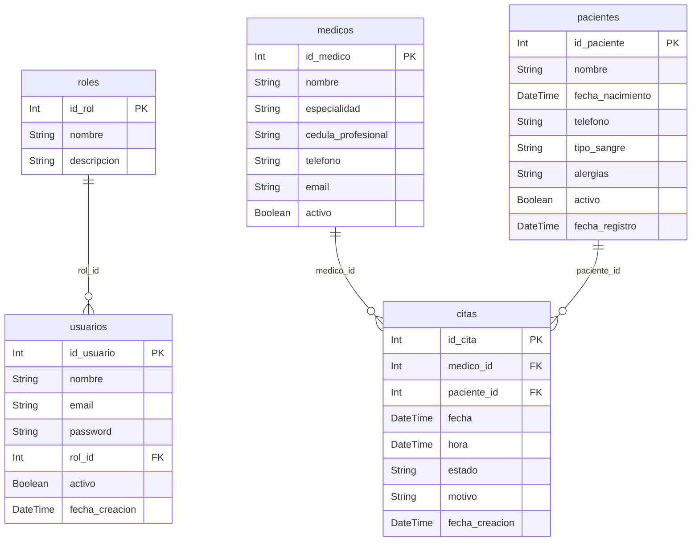

# Estructura Real de la Base de Datos - MediSystem

Este documento muestra las tablas y relaciones tal como están definidas exactamente en el archivo `schema.prisma` del sistema.

## Modelo Entidad-Relación (E-R) Técnico

## Detalle de Tablas (Esquema Técnico)

### 1. Tabla: `roles`
| Campo | Tipo | Atributos |
| :--- | :--- | :--- |
| `id_rol` | Int | Primary Key, Autoincrement |
| `nombre` | String | Unique |
| `descripcion` | String | Opcional |

### 2. Tabla: `usuarios`
| Campo | Tipo | Atributos |
| :--- | :--- | :--- |
| `id_usuario` | Int | Primary Key, Autoincrement |
| `nombre` | String | |
| `email` | String | Unique |
| `password` | String | |
| `rol_id` | Int | Foreign Key (roles.id_rol) |
| `activo` | Boolean | Default: true |
| `fecha_creacion` | DateTime | Default: now() |

### 3. Tabla: `medicos`
| Campo | Tipo | Atributos |
| :--- | :--- | :--- |
| `id_medico` | Int | Primary Key, Autoincrement |
| `nombre` | String | |
| `especialidad` | String | |
| `cedula_profesional` | String | Unique |
| `telefono` | String | Opcional |
| `email` | String | Opcional |
| `activo` | Boolean | Default: true |

### 4. Tabla: `pacientes`
| Campo | Tipo | Atributos |
| :--- | :--- | :--- |
| `id_paciente` | Int | Primary Key, Autoincrement |
| `nombre` | String | |
| `fecha_nacimiento` | DateTime | |
| `telefono` | String | Opcional |
| `tipo_sangre` | String | Opcional |
| `alergias` | String | Opcional |
| `activo` | Boolean | Default: true |
| `fecha_registro` | DateTime | Default: now() |

### 5. Tabla: `citas`
| Campo | Tipo | Atributos |
| :--- | :--- | :--- |
| `id_cita` | Int | Primary Key, Autoincrement |
| `medico_id` | Int | Foreign Key (medicos.id_medico) |
| `paciente_id` | Int | Foreign Key (pacientes.id_paciente) |
| `fecha` | DateTime | |
| `hora` | DateTime | |
| `estado` | String | Default: "Pendiente" |
| `motivo` | String | Opcional |
| `fecha_creacion` | DateTime | Default: now() |

---

**Nota:** La imagen visual con **diseño sencillo** se encuentra en el archivo `diseno_sencillo_db.png` dentro de esta misma carpeta.
