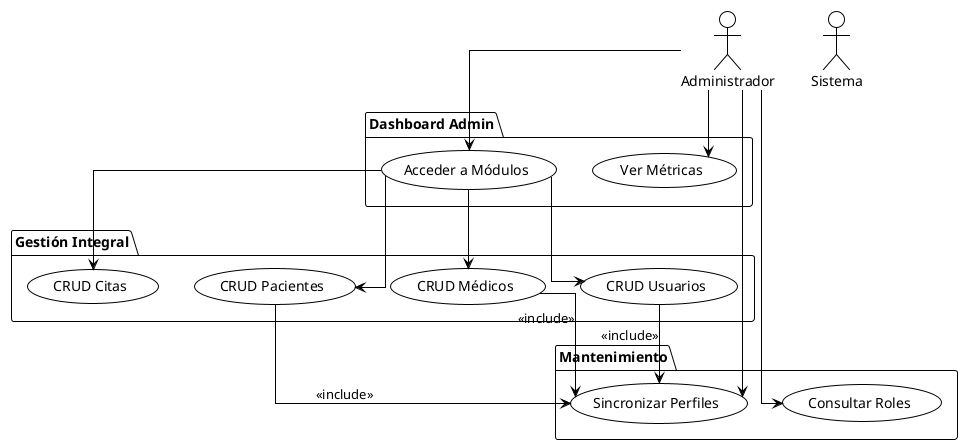
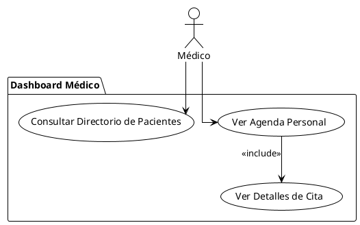
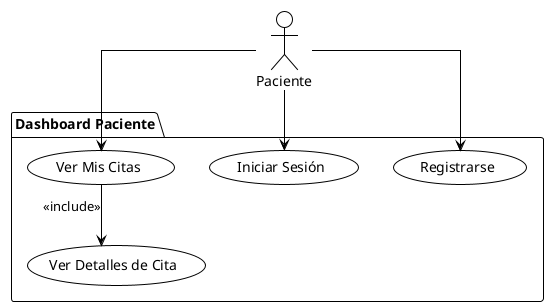
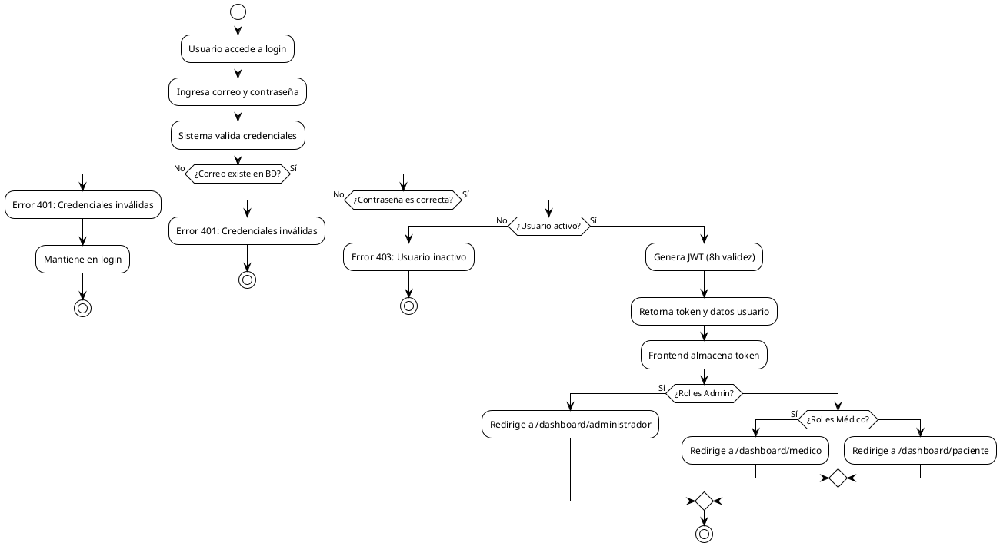
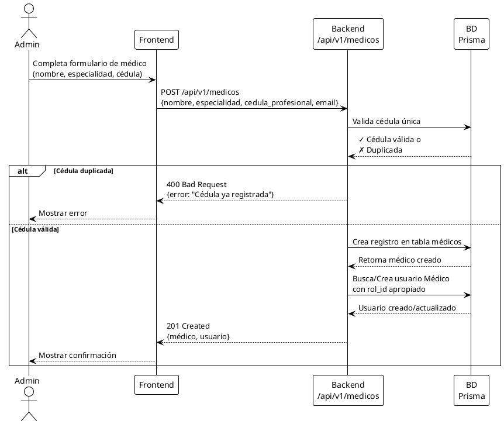
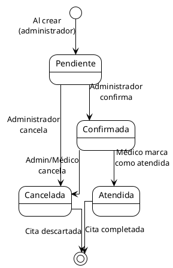

# 2.5 Diagramas de Casos de Uso - MediSystem

## Diagrama UML de Casos de Uso General

```plantuml
@startuml MediSystem_UseCases
!theme plain
skinparam linetype ortho
skinparam packageStyle rectangle
skinparam backgroundColor #F5F5F5

actor "Administrador" as Admin
actor "Médico" as Med
actor "Paciente" as Pac

package "Autenticación" {
  usecase "UC-AUTH-01: Iniciar Sesión" as UC_LOGIN
  usecase "UC-AUTH-02: Registrarse (Paciente)" as UC_REGISTER
  usecase "UC-AUTH-03: Cerrar Sesión" as UC_LOGOUT
}

package "Gestión de Usuarios" {
  usecase "UC-USR-01: Crear Usuario" as UC_CREATE_USR
  usecase "UC-USR-02: Consultar Usuarios" as UC_LIST_USR
  usecase "UC-USR-03: Actualizar Usuario" as UC_UPDATE_USR
  usecase "UC-USR-04: Eliminar Usuario (Lógico)" as UC_DELETE_USR
}

package "Gestión de Médicos" {
  usecase "UC-MED-01: Crear Médico" as UC_CREATE_MED
  usecase "UC-MED-02: Consultar Médicos" as UC_LIST_MED
  usecase "UC-MED-03: Actualizar Médico" as UC_UPDATE_MED
  usecase "UC-MED-04: Eliminar Médico (Lógico)" as UC_DELETE_MED
}

package "Gestión de Pacientes" {
  usecase "UC-PAC-01: Crear Paciente" as UC_CREATE_PAC
  usecase "UC-PAC-02: Consultar Pacientes" as UC_LIST_PAC
  usecase "UC-PAC-03: Actualizar Paciente" as UC_UPDATE_PAC
  usecase "UC-PAC-04: Eliminar Paciente (Lógico)" as UC_DELETE_PAC
}

package "Gestión de Citas" {
  usecase "UC-CIT-01: Crear Cita" as UC_CREATE_CIT
  usecase "UC-CIT-02: Consultar Citas" as UC_LIST_CIT
  usecase "UC-CIT-03: Actualizar Estado de Cita" as UC_UPDATE_CIT
  usecase "UC-CIT-04: Eliminar Cita" as UC_DELETE_CIT
}

package "Administración del Sistema" {
  usecase "UC-SYS-01: Sincronizar Sistema" as UC_SYNC
  usecase "UC-SYS-02: Health Check" as UC_HEALTH
  usecase "UC-SYS-03: Consultar Roles" as UC_ROLES
}

' Relaciones Administrador
Admin --> UC_LOGIN
Admin --> UC_REGISTER
Admin --> UC_LOGOUT
Admin --> UC_CREATE_USR
Admin --> UC_LIST_USR
Admin --> UC_UPDATE_USR
Admin --> UC_DELETE_USR
Admin --> UC_CREATE_MED
Admin --> UC_LIST_MED
Admin --> UC_UPDATE_MED
Admin --> UC_DELETE_MED
Admin --> UC_CREATE_PAC
Admin --> UC_LIST_PAC
Admin --> UC_UPDATE_PAC
Admin --> UC_DELETE_PAC
Admin --> UC_CREATE_CIT
Admin --> UC_LIST_CIT
Admin --> UC_UPDATE_CIT
Admin --> UC_DELETE_CIT
Admin --> UC_SYNC

' Relaciones Médico
Med --> UC_LOGIN
Med --> UC_LOGOUT
Med --> UC_LIST_CIT
Med --> UC_LIST_PAC

' Relaciones Paciente
Pac --> UC_LOGIN
Pac --> UC_REGISTER
Pac --> UC_LOGOUT
Pac --> UC_LIST_CIT

@enduml
```

---

## Diagrama Detallado por Rol: Administrador

---

## Diagrama Detallado por Rol: Médico

---

## Diagrama Detallado por Rol: Paciente

---

## Diagrama de Flujo de Autenticación

---

## Diagrama de Interacción: Crear Médico (Ejemplo)

---

## Diagrama de Estados: Cita

---

## Descripción de Casos de Uso Principales

### CU-AUTH-01: Iniciar Sesión
**Actores:** Administrador, Médico, Paciente  
**Precondiciones:** Usuario registrado en BD y activo.  
**Flujo principal:**
1. Actor accede a pantalla de login.
2. Ingresa correo y contraseña.
3. Sistema valida contra BD.
4. Si válido, genera JWT con rol.
5. Frontend redirige según rol.

**Flujo alternativo:**
- Credenciales inválidas → Error 401.
- Usuario inactivo → Error 403.

---

### CU-AUTH-02: Registrarse (Paciente)
**Actores:** Paciente  
**Precondiciones:** Ninguna.  
**Flujo principal:**
1. Paciente accede a formulario de registro.
2. Ingresa nombre, correo, contraseña.
3. Sistema valida unicidad del correo.
4. Crea usuario con rol "Paciente".
5. Crea registro sincronizado en tabla pacientes.
6. Redirige a login.

**Flujo alternativo:**
- Correo duplicado → Error 400.

---

### CU-USR-01: Crear Usuario
**Actores:** Administrador  
**Precondiciones:** Admin autenticado.  
**Flujo principal:**
1. Admin accede a módulo "Gestión de Usuarios".
2. Rellena formulario (nombre, correo, contraseña, rol).
3. Sistema valida unicidad de correo.
4. Crea usuario con hash de contraseña.
5. Si rol es "Médico", sincroniza perfil médico.
6. Si rol es "Paciente", sincroniza perfil paciente.
7. Muestra confirmación.

**Flujo alternativo:**
- Correo duplicado → Error 400.

---

### CU-MED-01: Crear Médico
**Actores:** Administrador  
**Precondiciones:** Admin autenticado.  
**Flujo principal:**
1. Admin accede a "Plantilla Médica".
2. Rellena nombre, especialidad, cédula (si no se genera automáticamente).
3. Opcionalmente ingresa teléfono y correo.
4. Sistema valida cédula única.
5. Crea registro médico.
6. Si correo existe como usuario Médico, vincula.
7. Si no existe usuario, crea automáticamente.
8. Muestra confirmación.

**Flujo alternativo:**
- Cédula duplicada → Error 400.

---

### CU-CIT-01: Crear Cita
**Actores:** Administrador  
**Precondiciones:** Admin autenticado; médico y paciente activos.  
**Flujo principal:**
1. Admin selecciona módulo "Citas".
2. Completa formulario: médico, paciente, fecha, hora, motivo.
3. Sistema valida:
   - Médico activo.
   - Paciente activo.
   - No exista cita duplicada (mismo médico, fecha, hora).
4. Crea cita con estado "Pendiente".
5. Muestra confirmación con detalles.

**Flujo alternativo:**
- Médico inactivo → Error de validación.
- Paciente inactivo → Error de validación.
- Cita duplicada → Error 400.

---

## Conclusiones

Los diagramas de casos de uso especifican las interacciones de cada actor con el sistema. Los flujos detallados garantizan que cada requerimiento funcional es traducible a funcionalidad verificable.
