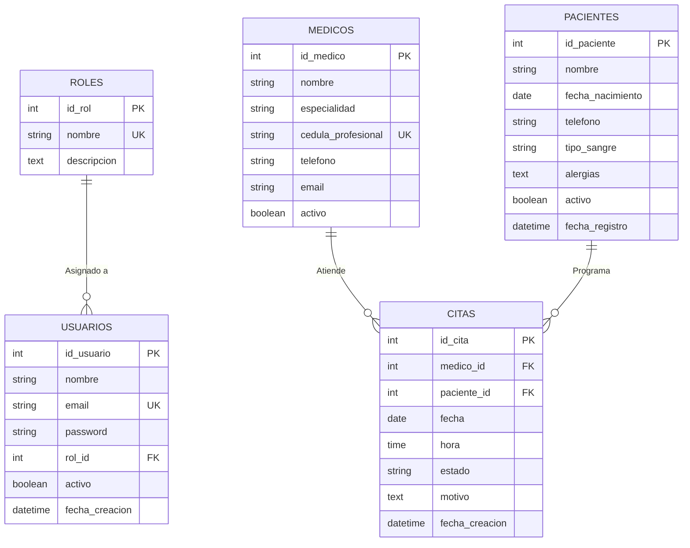
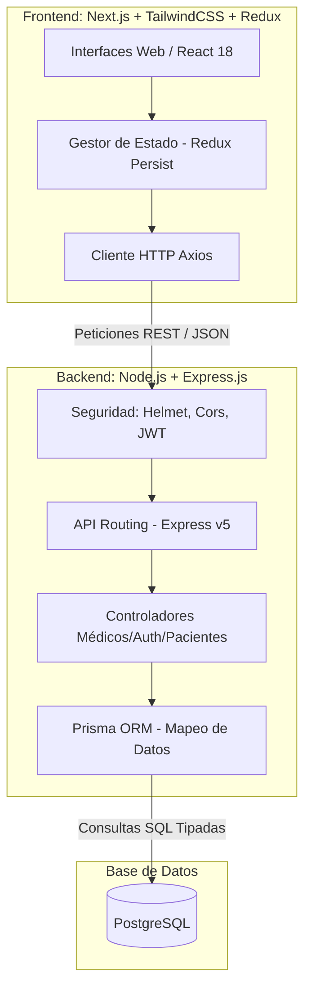

# Entrega III - Codificación: MediSystem

A continuación se encuentra el material técnico exacto para integrar en el documento PDF de la Entrega 3. 

## 3.1 Diseño Final de la Base de Datos (Modelo E-R)

## 3.2 Pantallas Finales del Sistema
Las pantallas creadas están en el proyecto ejecutando `npm run dev` en el directorio `frontend/`. 
1. **Login Dinámico:** `/` (Intercepción por roles: *admin* o *medico* en el correo redirige automáticamante).
2. **Dashboard de Administración:** `/dashboard/administrador` (Métricas en tiempo real, médicos, pacientes y citas).

## 3.3 Diagrama Final de la Arquitectura

## 3.4 Código Fuente (Funcionalidades Básicas)

El proyecto completo ha sido estructurado en:
- `backend/prisma/schema.prisma`: Control de tipos de BD e inyecciones.
- `backend/src/controllers/authController.ts`: Inicio de sesión, JWT (Roles).
- `backend/src/index.ts`: Arquitectura Express principal.
- `frontend/src/app/page.tsx`: Pantalla de Login (React Server Components).
- `frontend/src/app/dashboard/administrador/page.tsx`: Pantalla principal del perfil administrador.
