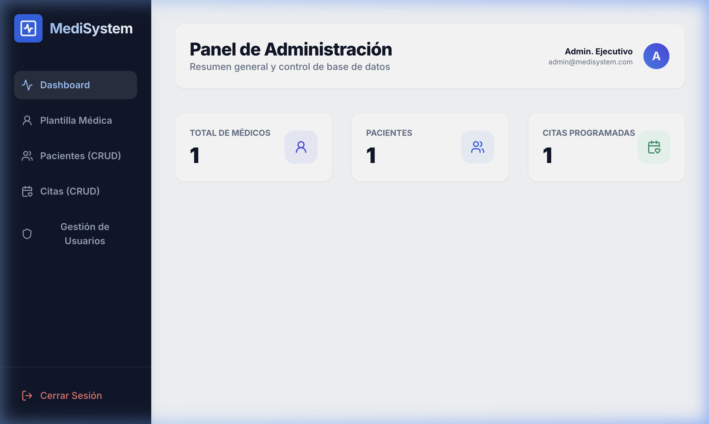
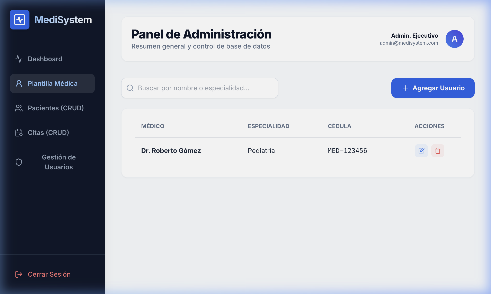
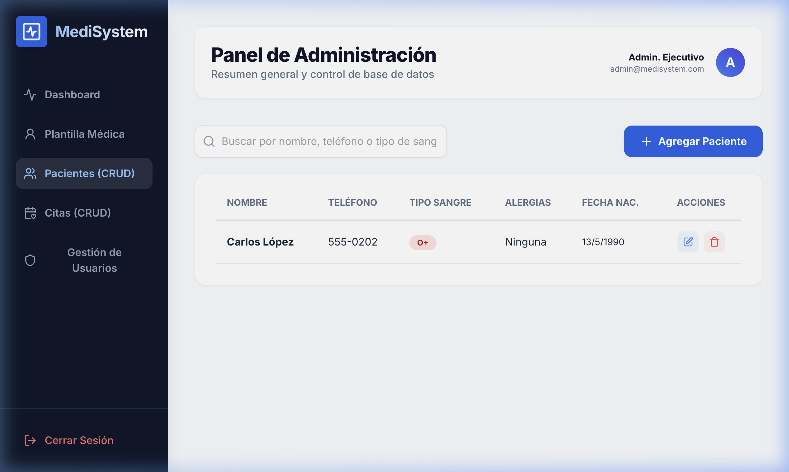
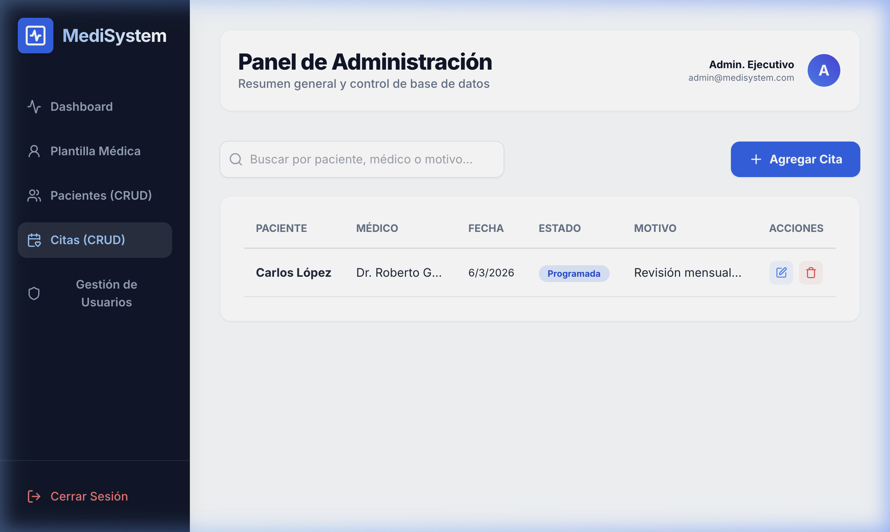
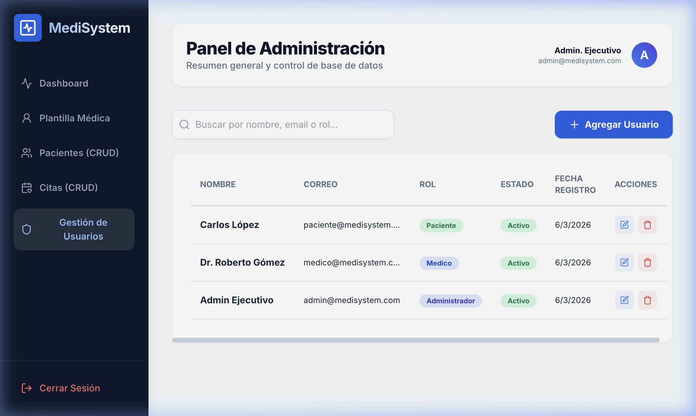
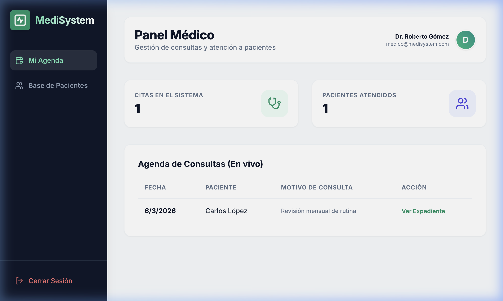
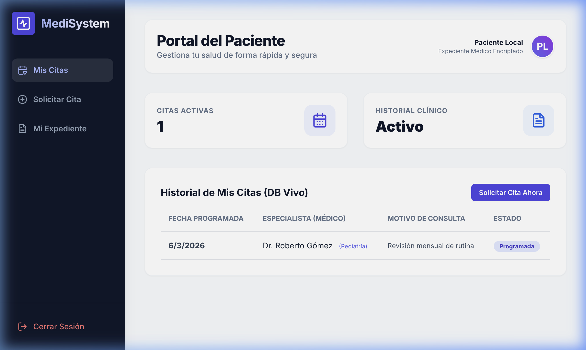

# Pantallas Finales del Sistema y Evidencia de Ejecución - MediSystem

Este documento presenta las interfaces finales del sistema MediSystem, demostrando el funcionamiento correcto para los tres roles principales definido en los requisitos.

## 1. Perfil Administrador

### Dashboard General
El panel principal del administrador muestra un resumen de los recursos activos del sistema.

### Gestión de Médicos
Interfaz para administrar la plantilla médica del hospital.

### Gestión de Pacientes
Registro y control de expedientes de pacientes.

### Control de Citas
Seguimiento de las consultas programadas.

### Administración de Usuarios
Control de accesos y roles del sistema.

## 2. Perfil Médico

### Dashboard del Especialista
Vista simplificada para que el médico gestione su agenda y pacientes asignados.

## 3. Perfil Paciente

### Portal del Paciente
Espacio personal donde el paciente consulta su historial y citas.

---
**Nota para Evaluación:** Las capturas fueron tomadas con el sistema en ejecución real, utilizando datos de prueba integrales para demostrar la interoperabilidad entre el frontend (Next.js) y el backend (PostgreSQL/Prisma).
