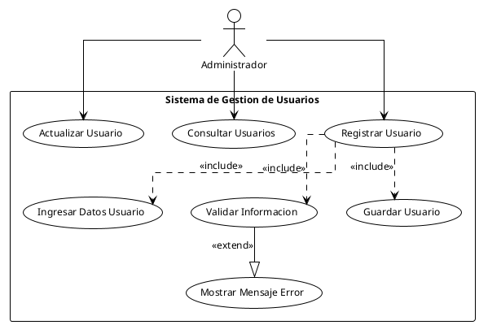
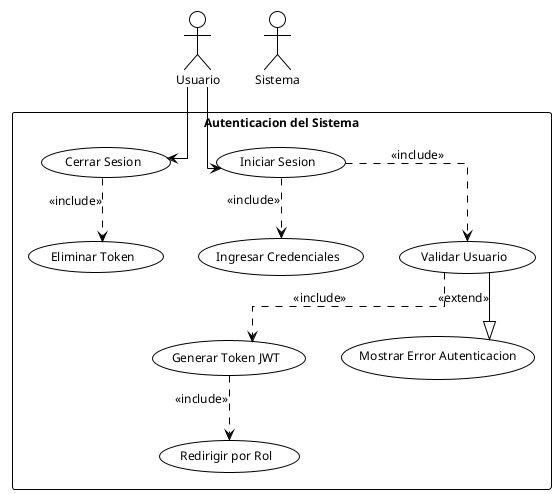
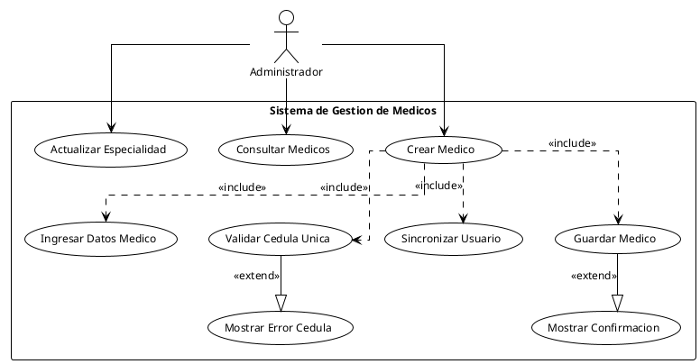
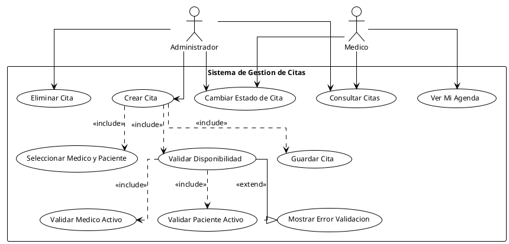
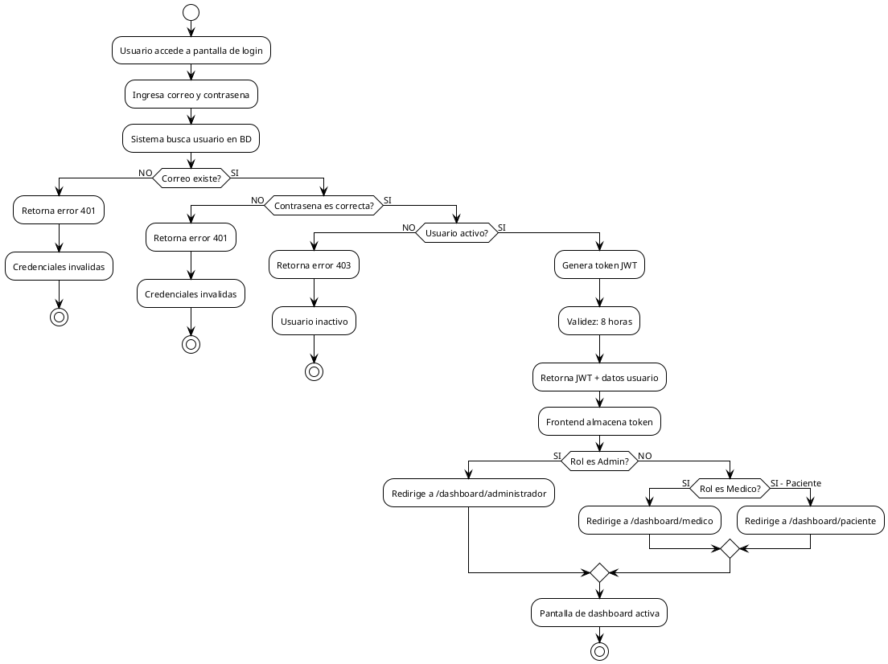
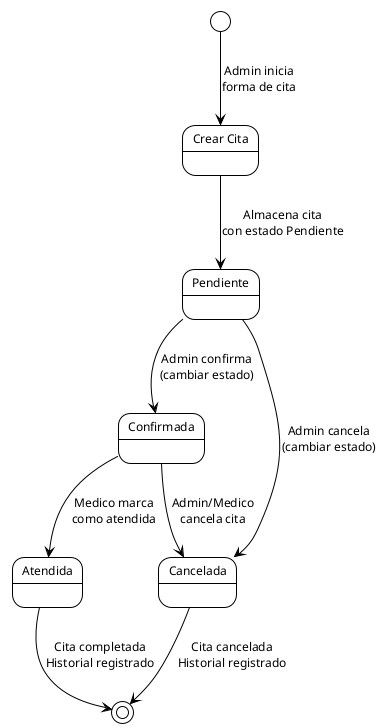

# 2.5 Diagramas de Casos de Uso - MediSystem

## Diagrama UML de Casos de Uso - Sistema MediSystem

```plantuml
@startuml MediSystem_Complete_UseCases
!theme plain
skinparam linetype ortho
skinparam packageStyle rectangle
skinparam backgroundColor #FFFFFF
skinparam defaultFontSize 12
skinparam defaultFontName Arial

actor "Administrador" as Admin
actor "Medico" as Med
actor "Paciente" as Pac

rectangle "Gestion de Usuarios" as US {
  usecase "Registrar Usuario" as UC_CREAR_USR
  usecase "Validar Datos Usuario" as UC_VALIDAR_USR
  usecase "Guardar Usuario" as UC_GUARDAR_USR
  usecase "Consultar Usuarios" as UC_LISTAR_USR
  usecase "Actualizar Usuario" as UC_ACTUALIZAR_USR
  usecase "Inactivar Usuario" as UC_INACTIVAR_USR
  
  UC_CREAR_USR ..> UC_VALIDAR_USR : <<include>>
  UC_CREAR_USR ..> UC_GUARDAR_USR : <<include>>
}

rectangle "Autenticacion" as AUTH {
  usecase "Iniciar Sesion" as UC_LOGIN
  usecase "Validar Credenciales" as UC_VALIDAR_CRED
  usecase "Generar JWT" as UC_GENERAR_JWT
  usecase "Cerrar Sesion" as UC_LOGOUT
  
  UC_LOGIN ..> UC_VALIDAR_CRED : <<include>>
  UC_LOGIN ..> UC_GENERAR_JWT : <<include>>
}

rectangle "Gestion de Medicos" as MED_SEC {
  usecase "Crear Medico" as UC_CREAR_MED
  usecase "Validar Cedula Unica" as UC_VALIDAR_CEDULA
  usecase "Sincronizar Usuario Medico" as UC_SYNC_MED
  usecase "Consultar Medicos" as UC_LISTAR_MED
  usecase "Actualizar Medico" as UC_ACTUALIZAR_MED
  usecase "Inactivar Medico" as UC_INACTIVAR_MED
  
  UC_CREAR_MED ..> UC_VALIDAR_CEDULA : <<include>>
  UC_CREAR_MED ..> UC_SYNC_MED : <<include>>
}

rectangle "Gestion de Pacientes" as PAC_SEC {
  usecase "Crear Paciente" as UC_CREAR_PAC
  usecase "Sincronizar Usuario Paciente" as UC_SYNC_PAC
  usecase "Consultar Pacientes" as UC_LISTAR_PAC
  usecase "Actualizar Paciente" as UC_ACTUALIZAR_PAC
  usecase "Inactivar Paciente" as UC_INACTIVAR_PAC
  
  UC_CREAR_PAC ..> UC_SYNC_PAC : <<include>>
}

rectangle "Gestion de Citas" as CITA_SEC {
  usecase "Crear Cita" as UC_CREAR_CIT
  usecase "Validar Disponibilidad" as UC_VALIDAR_CIT
  usecase "Consultar Citas" as UC_LISTAR_CIT
  usecase "Actualizar Estado Cita" as UC_ACTUALIZAR_CIT
  usecase "Eliminar Cita" as UC_ELIMINAR_CIT
  usecase "Ver Mi Agenda" as UC_MI_AGENDA
  
  UC_CREAR_CIT ..> UC_VALIDAR_CIT : <<include>>
}

rectangle "Sistema" as SYS {
  usecase "Sincronizar Sistema" as UC_SYNC_SYS
  usecase "Health Check" as UC_HEALTH
}

' Relaciones Administrador
Admin --> UC_CREAR_USR
Admin --> UC_LISTAR_USR
Admin --> UC_ACTUALIZAR_USR
Admin --> UC_INACTIVAR_USR

Admin --> UC_LOGIN
Admin --> UC_LOGOUT

Admin --> UC_CREAR_MED
Admin --> UC_LISTAR_MED
Admin --> UC_ACTUALIZAR_MED
Admin --> UC_INACTIVAR_MED

Admin --> UC_CREAR_PAC
Admin --> UC_LISTAR_PAC
Admin --> UC_ACTUALIZAR_PAC
Admin --> UC_INACTIVAR_PAC

Admin --> UC_CREAR_CIT
Admin --> UC_LISTAR_CIT
Admin --> UC_ACTUALIZAR_CIT
Admin --> UC_ELIMINAR_CIT

Admin --> UC_SYNC_SYS
Admin --> UC_HEALTH

' Relaciones Medico
Med --> UC_LOGIN
Med --> UC_LOGOUT
Med --> UC_MI_AGENDA
Med --> UC_LISTAR_CIT
Med --> UC_ACTUALIZAR_CIT
Med --> UC_LISTAR_PAC

' Relaciones Paciente
Pac --> UC_LOGIN
Pac --> UC_LOGOUT
Pac --> UC_CREAR_PAC
Pac --> UC_LISTAR_CIT

@enduml
```



---

## Diagrama Detallado: Gestion de Usuarios (Admin)



---

## Diagrama Detallado: Autenticacion



---

## Diagrama Detallado: Gestion de Medicos



---

## Diagrama Detallado: Gestion de Citas



---

## Diagrama de Flujo: Proceso de Autenticacion



---

## Diagrama de Secuencia: Crear Medico

```plantuml
@startuml Create_Medico_Sequence_Detailed
!theme plain
skinparam defaultFontSize 11
skinparam defaultFontName Arial
skinparam SequenceBoxBackgroundColor #FFFFFF
skinparam backgroundColor #FFFFFF

participant "Administrador" as Admin
participant "Frontend" as FE
participant "Backend API" as BE
participant "Base de Datos" as DB

Admin -> FE: Accede a Gestion Medicos
FE -> BE: GET /api/v1/medicos (lista actual)
BE -> DB: SELECT * FROM medicos
DB --> BE: Lista de medicos activos
BE --> FE: Retorna medicos con status 200
FE --> Admin: Muestra tabla de medicos

Admin -> FE: Completa formulario:\nnombre, especialidad, cedula, email

FE -> FE: Valida campos requeridos
FE -> BE: POST /api/v1/medicos\n{nombre, especialidad, cedula_profesional, email}

BE -> BE: Valida estructura datos
BE -> DB: SELECT FROM medicos\nWHERE cedula_profesional = 'ABC-123'
DB --> BE: Resultado: vacio

alt Cedula ya existe
  DB --> BE: Resultado: cedula existe
  BE --> FE: 400 Bad Request\n{error: "Cedula ya registrada"}
  FE --> Admin: Muestra error en formulario
  stop
else Cedula valida
  BE -> DB: INSERT INTO medicos\n(nombre, especialidad, cedula, email, activo)
  DB --> BE: INSERT ejecutado, retorna id_medico
  
  alt Email proporcionado
    BE -> DB: SELECT FROM usuarios WHERE email = 'medico@email.com'
    DB --> BE: Usuario no existe o existe
    
    alt Usuario no existe
      BE -> DB: INSERT INTO usuarios\n(nombre, email, password, rol_id, activo)
      DB --> BE: Usuario creado con rol_id = Medico
    else Usuario existe
      BE -> DB: UPDATE usuarios SET activo = true
      DB --> BE: Usuario actualizado
    end
  end
  
  BE --> FE: 201 Created\n{id_medico: 5, nombre, especialidad, cedula}
  FE --> Admin: Mensaje exitoso: Medico registrado
  FE -> FE: Limpia formulario
  FE -> BE: GET /api/v1/medicos (actualiza tabla)
end

@enduml
```

---

## Diagrama de Estados: Ciclo de Vida Cita



---

## Resumen Visual: Matriz de Casos de Uso por Rol

```
ADMINISTRADOR
├─ Autenticacion
│  ├─ UC-AUTH-01: Iniciar Sesion
│  │  - Valida correo y contrasena
│  │  - Genera JWT con rol
│  │  - Redirige a dashboard admin
│  └─ UC-AUTH-03: Cerrar Sesion
│
├─ Usuarios (CRUD)
│  ├─ UC-USR-01: Crear Usuario
│  │  - Validar datos requeridos
│  │  - Validar email unico
│  │  - Hash contrasena bcrypt
│  │  - Asignar rol
│  ├─ UC-USR-02: Consultar Usuarios
│  │  - Listar con filtros
│  │  - Paginacion opcional
│  │  - Ver estado activo/inactivo
│  ├─ UC-USR-03: Actualizar Usuario
│  │  - Editar nombre, email, rol
│  │  - Cambiar estado
│  └─ UC-USR-04: Inactivar Usuario
│     - Soft delete (activo = false)
│
├─ Medicos (CRUD)
│  ├─ UC-MED-01: Crear Medico
│  │  - Ingresar especialidad
│  │  - Validar cedula unica
│  │  - Sincronizar con usuarios
│  │  - Generar cedula automatica si es vacia
│  ├─ UC-MED-02: Consultar Medicos
│  │  - Listar con filtros
│  │  - Ver especialidad, status
│  ├─ UC-MED-03: Actualizar Medico
│  │  - Cambiar especialidad, telefono, email
│  └─ UC-MED-04: Inactivar Medico
│     - Soft delete (activo = false)
│
├─ Pacientes (CRUD)
│  ├─ UC-PAC-01: Crear Paciente
│  │  - Datos basicos: nombre, fecha nacimiento
│  │  - Tipo sangre, alergias (optionales)
│  │  - Sincronizar con usuarios
│  ├─ UC-PAC-02: Consultar Pacientes
│  │  - Listar con filtros
│  │  - Ver datos basicos
│  ├─ UC-PAC-03: Actualizar Paciente
│  │  - Editar todos los campos
│  └─ UC-PAC-04: Inactivar Paciente
│     - Soft delete (activo = false)
│
├─ Citas (CRUD)
│  ├─ UC-CIT-01: Crear Cita
│  │  - Validar medico activo
│  │  - Validar paciente activo
│  │  - Verificar disponibilidad
│  │  - Estado inicial: Pendiente
│  ├─ UC-CIT-02: Consultar Citas
│  │  - Filtrar por medico, paciente, fecha
│  │  - Ver estado de cita
│  ├─ UC-CIT-03: Actualizar Estado Cita
│  │  - Transiciones: Pendiente -> Confirmada -> Atendida
│  │  - Permitir cancelacion
│  └─ UC-CIT-04: Eliminar Cita
│     - Hard delete permitido
│
└─ Sistema
   ├─ UC-SYS-01: Sincronizar Sistema
   │  - Valida usuario-medico
   │  - Valida usuario-paciente
   │  - Retorna resumen
   └─ UC-SYS-02: Health Check
      - Retorna status 200

MEDICO
├─ Autenticacion
│  ├─ UC-AUTH-01: Iniciar Sesion
│  └─ UC-AUTH-03: Cerrar Sesion
├─ Citas
│  ├─ UC-CIT-02: Ver Mi Agenda
│  │  - Filtrar citas personales
│  │  - Ordenar por fecha
│  └─ UC-CIT-03: Cambiar Estado Cita
│     - Marcar como atendida
└─ Pacientes
   └─ UC-PAC-02: Consultar Directorio
      - Ver informacion basica

PACIENTE
├─ Autenticacion
│  ├─ UC-AUTH-02: Registrarse
│  │  - Nombre, correo, contrasena
│  │  - Crear usuario patient role
│  │  - Crear perfil paciente
│  ├─ UC-AUTH-01: Iniciar Sesion
│  └─ UC-AUTH-03: Cerrar Sesion
└─ Citas
   └─ UC-CIT-02: Ver Mis Citas
      - Listar citas del paciente
      - Ver estado y medico
```

---

## Tabla Ejecutiva: Especificacion de Casos de Uso Clave

| ID | Nombre Caso de Uso | Actor | Precondiciones | Flujo Principal | Resultado |
|:---|:-------------------|:------|:---------------|:----------------|:----------|
| UC-AUTH-01 | Iniciar Sesion | Admin, Medico, Paciente | Sistema disponible | 1. Ingresa credenciales<br>2. Valida contra BD<br>3. Genera JWT<br>4. Redirige por rol | Usuario autenticado con token valido |
| UC-AUTH-02 | Registrarse | Paciente | Email no registrado | 1. Completa formulario<br>2. Valida datos<br>3. Crea usuario<br>4. Crea paciente | Paciente registrado, redirige a login |
| UC-USR-01 | Crear Usuario | Admin | Admin autenticado | 1. Ingresa datos<br>2. Valida email unico<br>3. Hash contrasena<br>4. Asigna rol<br>5. Guarda en BD | Usuario creado, mostrar confirmacion |
| UC-MED-01 | Crear Medico | Admin | Admin autenticado | 1. Ingresa datos<br>2. Valida cedula unica<br>3. Sincroniza usuario<br>4. Guarda medico | Medico registrado, usuario sincronizado |
| UC-PAC-01 | Crear Paciente | Admin | Admin autenticado | 1. Ingresa datos basicos<br>2. Sincroniza usuario<br>3. Guarda paciente | Paciente registrado, usuario sincronizado |
| UC-CIT-01 | Crear Cita | Admin | Medico y paciente activos | 1. Selecciona medico<br>2. Selecciona paciente<br>3. Valida disponibilidad<br>4. Asigna fecha/hora<br>5. Guarda cita | Cita creada estado Pendiente |
| UC-CIT-03 | Cambiar Estado Cita | Admin, Medico | Cita existe | Selecciona nuevo estado siguiendo maquina de estados | Cita actualizada, historial registrado |

---

## Especificacion Detallada de Casos de Uso Principales

### UC-AUTH-01: Iniciar Sesion

**Actor Primario:** Administrador, Medico, Paciente

**Precondiciones:**
- Sistema disponible
- Usuario registrado en BD y activo

**Flujo Principal:**
1. Usuario accede a pantalla de login
2. Ingresa correo electronico y contrasena
3. Sistema busca usuario por correo en BD
4. Valida que usuario exista y este activo
5. Compara contrasena con hash bcrypt almacenado
6. Si es valida, genera token JWT con validity de 8 horas
7. Retorna JWT + datos usuario (id, nombre, email, rol)
8. Frontend almacena token en localStorage/sessionStorage
9. Frontend redirige segun rol del usuario:
   - Si rol = "Administrador" -> /dashboard/administrador
   - Si rol = "Medico" -> /dashboard/medico
   - Si rol = "Paciente" -> /dashboard/paciente

**Flujos Alternativos:**
- Correo no existe: Retorna error 401 "Credenciales invalidas"
- Contrasena incorrecta: Retorna error 401 "Credenciales invalidas"
- Usuario inactivo: Retorna error 403 "Usuario inactivo"

**Postcondiciones:**
- Usuario autenticado y sesion activa
- Token disponible en cliente para proximas peticiones

---

### UC-USR-01: Crear Usuario

**Actor Primario:** Administrador

**Precondiciones:**
- Admin autenticado y con permiso
- Sistema disponible

**Flujo Principal:**
1. Admin accede a modulo "Gestion de Usuarios"
2. Selecciona "Crear Usuario"
3. Completa formulario: nombre, correo, contrasena, rol
4. Sistema valida campos requeridos
5. Valida que email sea unico en BD
6. Aplica hash bcrypt a contrasena (10 rondas minimo)
7. Crea registro en tabla usuarios
8. Si rol es "Medico":
   - Sincroniza creando perfil en tabla medicos
   - Asigna cedula automatica AUTO-MED-{id_usuario} si es vacia
9. Si rol es "Paciente":
   - Sincroniza creando perfil en tabla pacientes
   - Asigna fecha nacimiento default
10. Retorna confirmacion: "Usuario creado exitosamente"
11. Muestra usuario en listado de usuarios

**Flujos Alternativos:**
- Email ya existe: Retorna error 400 "Correo ya registrado"
- Campos requeridos vacios: Retorna error 400 con validacion
- Rol inexistente: Retorna error 400 "Rol no valido"

**Postcondiciones:**
- Usuario creado y persistido en BD
- Si aplica, perfil medico/paciente sincronizado
- Usuario visible en listados correspondientes

---

### UC-MED-01: Crear Medico

**Actor Primario:** Administrador

**Precondiciones:**
- Admin autenticado
- Datos del medico disponibles

**Flujo Principal:**
1. Admin accede a "Plantilla Medica"
2. Selecciona "Crear Medico"
3. Ingresa: nombre, especialidad, cedula profesional, telefono (opt), correo (opt)
4. Sistema valida cedula sea unica
5. Si cedula esta vacia, genera automaticamente: AUTO-MED-{id_usuario}
6. Crea registro en tabla medicos
7. Si se proporciona correo:
   - Busca usuario existente con ese correo
   - Si existe y rol="Medico": vincula
   - Si no existe: crea usuario con rol="Medico" asociado
8. Retorna confirmacion: "Medico registrado exitosamente"
9. Actualiza tabla de medicos en frontend
10. Opcionalmente, ejecuta sincronizacion de perfiles

**Flujos Alternativos:**
- Cedula ya existe: Retorna error 400 "Cedula ya registrada"
- Nombre vacio: Retorna error 400 "Nombre requerido"
- Especialidad vacia: Retorna error 400 "Especialidad requerida"

**Postcondiciones:**
- Medico creado y persistido
- Usuario asociado creado/actualizado si aplica
- Medico disponible para asignacion en citas

---

### UC-CIT-01: Crear Cita

**Actor Primario:** Administrador

**Precondiciones:**
- Admin autenticado
- Medico activo existe en BD
- Paciente activo existe en BD
- Fecha y hora propuestas son validas

**Flujo Principal:**
1. Admin accede a modulo "Citas"
2. Selecciona "Crear Cita"
3. Completa formulario:
   - Selecciona medico (dropdown)
   - Selecciona paciente (dropdown)
   - Ingresa fecha (date picker)
   - Ingresa hora (time picker)
   - Ingresa motivo (texto, opcional)
4. Sistema valida:
   - Medico existe y activo=true
   - Paciente existe y activo=true
   - No existe otra cita con mismo medico, fecha, hora (avoid duplicados)
   - Hora es en horario valido (ej: 08:00 - 18:00)
5. Si validaciones pasan:
   - Crea registro en tabla citas
   - Estado inicial: "Pendiente"
   - fecha_creacion = NOW()
6. Retorna confirmacion con detalles de cita
7. Actualiza lista de citas en frontend

**Flujos Alternativos:**
- Medico inactivo: Error 400 "Medico no disponible"
- Paciente inactivo: Error 400 "Paciente no disponible"
- Cita duplicada: Error 400 "Cita con estos parametros ya existe"
- Hora fuera de rango: Error 400 "Hora invalida"

**Postcondiciones:**
- Cita creada y persistida
- Estado inicial = Pendiente
- Disponible para cambio de estado
- Visible en agenda del medico y paciente

---

## Conclusiones de los Diagramas UML

Los diagramas de casos de uso presentados formalizan la interaccion entre actores y el sistema MediSystem mediante:

1. **Diagramas UML detallados con relaciones:**
   - Inclusiones (<<include>>): funcionalidades reutilizables
   - Extensiones (<<extend>>): flujos alternos opcionales
   - Actores y casos de uso claramente identificados

2. **Especificacion estructurada:**
   - Precondiciones explicitadas
   - Flujos principales paso a paso
   - Flujos alternativos documentados
   - Postcondiciones verificables

3. **Trazabilidad completa:**
   - Cada caso de uso vinculado a historias de usuario
   - Cada caso de uso vinculado a requerimientos funcionales
   - Diagramas secuenciales y de estados para complejidad adicional

4. **Validacion de implementacion:**
   - Los casos de uso sirven como base para pruebas
   - Cada postcondicion es verificable
   - Los flujos alternativos cubren escenarios error

