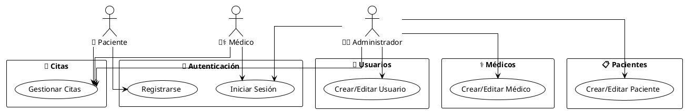
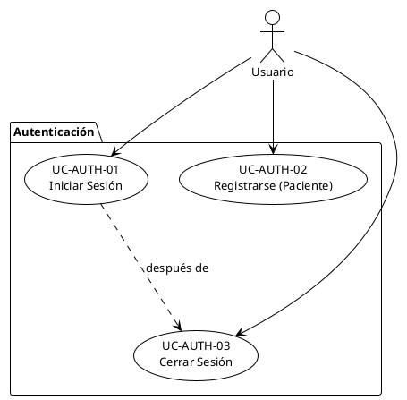
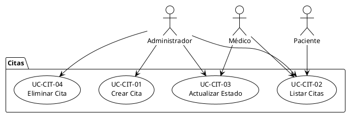
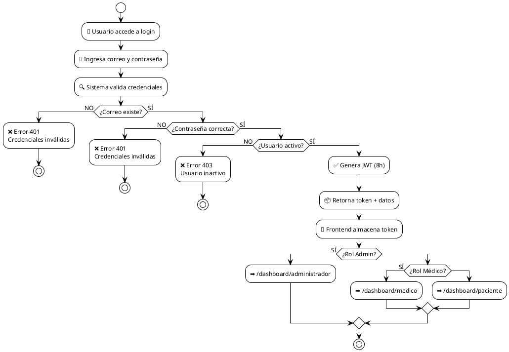
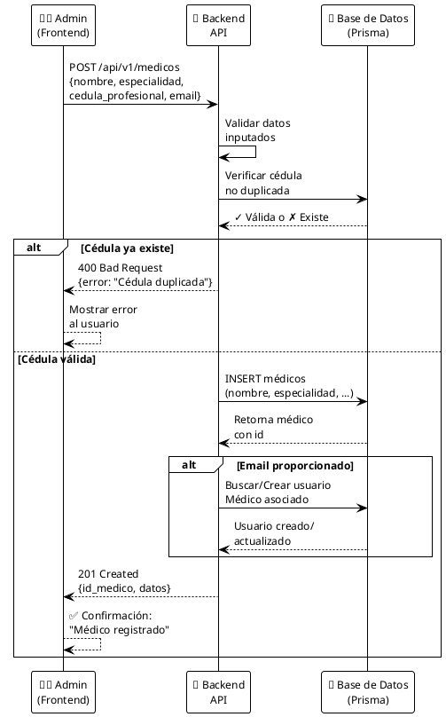
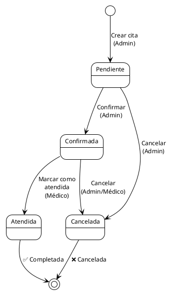

# 2.5 Diagramas de Casos de Uso - MediSystem

## Diagrama UML de Casos de Uso General (Visión de Alto Nivel)



---

### Visión Detallada por Módulo

#### A) Casos de Uso - Autenticación



#### B) Casos de Uso - Gestión de Entidades (Administrador)

```plantuml
@startuml Admin_UseCases_Entities
!theme plain
skinparam defaultFontSize 13
skinparam defaultFontName Arial
skinparam backgroundColor #FFFFFF

actor "Administrador" as Admin

package "Usuarios" {
  usecase "Crear Usuario" as UC_USR_C
  usecase "Listar Usuarios" as UC_USR_R
  usecase "Actualizar Usuario" as UC_USR_U
  usecase "Inactivar Usuario" as UC_USR_D
}

package "Médicos" {
  usecase "Crear Médico" as UC_MED_C
  usecase "Listar Médicos" as UC_MED_R
  usecase "Actualizar Médico" as UC_MED_U
  usecase "Inactivar Médico" as UC_MED_D
}

package "Pacientes" {
  usecase "Crear Paciente" as UC_PAC_C
  usecase "Listar Pacientes" as UC_PAC_R
  usecase "Actualizar Paciente" as UC_PAC_U
  usecase "Inactivar Paciente" as UC_PAC_D
}

Admin --> UC_USR_C
Admin --> UC_USR_R
Admin --> UC_USR_U
Admin --> UC_USR_D

Admin --> UC_MED_C
Admin --> UC_MED_R
Admin --> UC_MED_U
Admin --> UC_MED_D

Admin --> UC_PAC_C
Admin --> UC_PAC_R
Admin --> UC_PAC_U
Admin --> UC_PAC_D

@enduml
```



#### C) Casos de Uso - Gestión de Citas



---

## Diagrama de Flujo: Proceso de Autenticación



---

## Diagrama de Secuencia: Crear Médico en Sistema



---

## Diagrama de Estados: Ciclo de Vida de una Cita



---

## Resumen Visual: Matriz de Casos de Uso por Rol

```
┌────────────────────────────────────────────────────────────────────────────────┐
│                           MEDISYSTEM - CASOS DE USO                            │
├────────────────────────────────────────────────────────────────────────────────┤
│                                                                                 │
│  👨‍💼 ADMINISTRADOR                                                               │
│  ├─ 🔐 Autenticación                                                           │
│  │  ├─ UC-AUTH-01: Iniciar sesión                                             │
│  │  └─ UC-AUTH-03: Cerrar sesión                                              │
│  │                                                                             │
│  ├─ 👥 Usuarios (CRUD)                                                        │
│  │  ├─ UC-USR-01: Crear usuario                                               │
│  │  ├─ UC-USR-02: Listar usuarios                                             │
│  │  ├─ UC-USR-03: Actualizar usuario                                          │
│  │  └─ UC-USR-04: Inactivar usuario                                           │
│  │                                                                             │
│  ├─ ⚕️  Médicos (CRUD)                                                        │
│  │  ├─ UC-MED-01: Crear médico                                                │
│  │  ├─ UC-MED-02: Listar médicos                                              │
│  │  ├─ UC-MED-03: Actualizar médico                                           │
│  │  └─ UC-MED-04: Inactivar médico                                            │
│  │                                                                             │
│  ├─ 📋 Pacientes (CRUD)                                                       │
│  │  ├─ UC-PAC-01: Crear paciente                                              │
│  │  ├─ UC-PAC-02: Listar pacientes                                            │
│  │  ├─ UC-PAC-03: Actualizar paciente                                         │
│  │  └─ UC-PAC-04: Inactivar paciente                                          │
│  │                                                                             │
│  └─ 📅 Citas (CRUD)                                                           │
│     ├─ UC-CIT-01: Crear cita                                                  │
│     ├─ UC-CIT-02: Listar citas                                                │
│     ├─ UC-CIT-03: Actualizar estado cita                                      │
│     └─ UC-CIT-04: Eliminar cita                                               │
│                                                                                 │
├────────────────────────────────────────────────────────────────────────────────┤
│                                                                                 │
│  👨‍⚕️  MÉDICO                                                                    │
│  ├─ 🔐 Autenticación                                                           │
│  │  ├─ UC-AUTH-01: Iniciar sesión                                             │
│  │  └─ UC-AUTH-03: Cerrar sesión                                              │
│  │                                                                             │
│  ├─ 📅 Citas                                                                  │
│  │  ├─ UC-CIT-02: Ver mi agenda                                               │
│  │  └─ UC-CIT-03: Cambiar estado de cita                                      │
│  │                                                                             │
│  └─ 📋 Pacientes                                                              │
│     └─ UC-PAC-02: Consultar directorio                                        │
│                                                                                 │
├────────────────────────────────────────────────────────────────────────────────┤
│                                                                                 │
│  👤 PACIENTE                                                                   │
│  ├─ 🔐 Autenticación                                                           │
│  │  ├─ UC-AUTH-02: Registrarse                                                │
│  │  ├─ UC-AUTH-01: Iniciar sesión                                             │
│  │  └─ UC-AUTH-03: Cerrar sesión                                              │
│  │                                                                             │
│  └─ 📅 Citas                                                                  │
│     └─ UC-CIT-02: Ver mis citas                                               │
│                                                                                 │
└────────────────────────────────────────────────────────────────────────────────┘
```

---

## Tabla Ejecutiva: Casos de Uso Clave

| ID | Nombre | Actores | Precondición | Efecto |
|:---|:-------|:--------|:-------------|:-------|
| **UC-AUTH-01** | Iniciar sesión | Admin, Médico, Paciente | Ninguna | Genera JWT, redirige por rol |
| **UC-AUTH-02** | Registrarse | Paciente | Correo único | Crea usuario + paciente |
| **UC-USR-01** | Crear usuario | Admin | Admin autenticado | Crea usuario con rol asignado |
| **UC-MED-01** | Crear médico | Admin | Admin autenticado | Crea médico + usuario Médico |
| **UC-PAC-01** | Crear paciente | Admin | Admin autenticado | Crea paciente + usuario Paciente |
| **UC-CIT-01** | Crear cita | Admin | Med/Pac activos | Crea cita estado Pendiente |
| **UC-CIT-03** | Cambiar estado cita | Admin, Médico | Cita existe | Transiciona estado (máquina) |

---

## Especificación Detallada de Casos de Uso Clave

### CU-AUTH-01: Iniciar Sesión
**Actores:** Administrador, Médico, Paciente  
**Precondiciones:** Usuario registrado en BD y activo.  
**Flujo principal:**
1. Actor accede a pantalla de login.
2. Ingresa correo y contraseña.
3. Sistema valida contra BD.
4. Si válido, genera JWT con rol.
5. Frontend redirige según rol.

**Flujo alternativo:**
- Credenciales inválidas → Error 401.
- Usuario inactivo → Error 403.

---

### CU-AUTH-02: Registrarse (Paciente)
**Actores:** Paciente  
**Precondiciones:** Ninguna.  
**Flujo principal:**
1. Paciente accede a formulario de registro.
2. Ingresa nombre, correo, contraseña.
3. Sistema valida unicidad del correo.
4. Crea usuario con rol "Paciente".
5. Crea registro sincronizado en tabla pacientes.
6. Redirige a login.

**Flujo alternativo:**
- Correo duplicado → Error 400.

---

### CU-USR-01: Crear Usuario
**Actores:** Administrador  
**Precondiciones:** Admin autenticado.  
**Flujo principal:**
1. Admin accede a módulo "Gestión de Usuarios".
2. Rellena formulario (nombre, correo, contraseña, rol).
3. Sistema valida unicidad de correo.
4. Crea usuario con hash de contraseña.
5. Si rol es "Médico", sincroniza perfil médico.
6. Si rol es "Paciente", sincroniza perfil paciente.
7. Muestra confirmación.

**Flujo alternativo:**
- Correo duplicado → Error 400.

---

### CU-MED-01: Crear Médico
**Actores:** Administrador  
**Precondiciones:** Admin autenticado.  
**Flujo principal:**
1. Admin accede a "Plantilla Médica".
2. Rellena nombre, especialidad, cédula (si no se genera automáticamente).
3. Opcionalmente ingresa teléfono y correo.
4. Sistema valida cédula única.
5. Crea registro médico.
6. Si correo existe como usuario Médico, vincula.
7. Si no existe usuario, crea automáticamente.
8. Muestra confirmación.

**Flujo alternativo:**
- Cédula duplicada → Error 400.

---

### CU-CIT-01: Crear Cita
**Actores:** Administrador  
**Precondiciones:** Admin autenticado; médico y paciente activos.  
**Flujo principal:**
1. Admin selecciona módulo "Citas".
2. Completa formulario: médico, paciente, fecha, hora, motivo.
3. Sistema valida:
   - Médico activo.
   - Paciente activo.
   - No exista cita duplicada (mismo médico, fecha, hora).
4. Crea cita con estado "Pendiente".
5. Muestra confirmación con detalles.

**Flujo alternativo:**
- Médico inactivo → Error de validación.
- Paciente inactivo → Error de validación.
- Cita duplicada → Error 400.

---

## Conclusiones de los Diagramas UML

Los diagramas de casos de uso y flujos presentados formalizan la interacción entre actores (Administrador, Médico, Paciente) y el sistema MediSystem. Cada diagrama:

1. **Claridad funcional:** Identifica qué acciones ejecuta cada rol.
2. **Trazabilidad:** Vincula a requerimientos funcionales específicos.
3. **Validación:** Permite verificar que la implementación cumple especificaciones.
4. **Comunicación:** Sirve como referencia visual para stakeholders técnicos y no técnicos.

Con estos diagramas, el equipo de desarrollo cuenta con una especificación visual precisa para la construcción e implementación de la plataforma.
