# 2.5 Diagrama de Casos de Uso - MediSystem

## Diagrama Completo del Sistema

```plantuml
@startuml MediSystem_UseCases_Complete
!theme plain
skinparam linetype ortho
skinparam packageStyle rectangle
skinparam backgroundColor #FFFFFF
skinparam defaultFontSize 11
skinparam defaultFontName Arial

actor "Administrador" as Admin
actor "Medico" as Med
actor "Paciente" as Pac

rectangle "AUTENTICACION Y ACCESO" as AUTH {
  usecase "Iniciar Sesion" as UC_LOGIN
  usecase "Validar Credenciales" as UC_VAL_CRED
  usecase "Generar Token JWT" as UC_GEN_JWT
  usecase "Redirigir Por Rol" as UC_REDIRECT
  usecase "Cerrar Sesion" as UC_LOGOUT
  
  UC_LOGIN ..> UC_VAL_CRED : <<include>>
  UC_LOGIN ..> UC_GEN_JWT : <<include>>
  UC_GEN_JWT ..> UC_REDIRECT : <<include>>
}

rectangle "GESTION DE USUARIOS" as USERS {
  usecase "Crear Usuario" as UC_CREATE_USER
  usecase "Ingresar Datos Usuario" as UC_INGRESAR_USER
  usecase "Validar Email Unico" as UC_VAL_EMAIL
  usecase "Guardar Usuario" as UC_SAVE_USER
  usecase "Consultar Usuarios" as UC_LIST_USER
  usecase "Actualizar Usuario" as UC_UPDATE_USER
  usecase "Inactivar Usuario" as UC_DEACTIVATE_USER
  usecase "Mostrar Mensaje Error" as UC_ERROR_USER
  
  UC_CREATE_USER ..> UC_INGRESAR_USER : <<include>>
  UC_CREATE_USER ..> UC_VAL_EMAIL : <<include>>
  UC_CREATE_USER ..> UC_SAVE_USER : <<include>>
  UC_VAL_EMAIL --|> UC_ERROR_USER : <<extend>>
}

rectangle "GESTION DE MEDICOS" as MEDICOS {
  usecase "Crear Medico" as UC_CREATE_MED
  usecase "Ingresar Datos Medico" as UC_INGRESAR_MED
  usecase "Validar Cedula Unica" as UC_VAL_CEDULA
  usecase "Sincronizar Usuario Medico" as UC_SYNC_MED
  usecase "Guardar Medico" as UC_SAVE_MED
  usecase "Consultar Medicos" as UC_LIST_MED
  usecase "Actualizar Medico" as UC_UPDATE_MED
  usecase "Inactivar Medico" as UC_DEACTIVATE_MED
  usecase "Mostrar Error Cedula" as UC_ERROR_MED
  
  UC_CREATE_MED ..> UC_INGRESAR_MED : <<include>>
  UC_CREATE_MED ..> UC_VAL_CEDULA : <<include>>
  UC_CREATE_MED ..> UC_SYNC_MED : <<include>>
  UC_CREATE_MED ..> UC_SAVE_MED : <<include>>
  UC_VAL_CEDULA --|> UC_ERROR_MED : <<extend>>
}

rectangle "GESTION DE PACIENTES" as PACIENTES {
  usecase "Crear Paciente" as UC_CREATE_PAC
  usecase "Ingresar Datos Paciente" as UC_INGRESAR_PAC
  usecase "Sincronizar Usuario Paciente" as UC_SYNC_PAC
  usecase "Guardar Paciente" as UC_SAVE_PAC
  usecase "Consultar Pacientes" as UC_LIST_PAC
  usecase "Actualizar Paciente" as UC_UPDATE_PAC
  usecase "Inactivar Paciente" as UC_DEACTIVATE_PAC
  
  UC_CREATE_PAC ..> UC_INGRESAR_PAC : <<include>>
  UC_CREATE_PAC ..> UC_SYNC_PAC : <<include>>
  UC_CREATE_PAC ..> UC_SAVE_PAC : <<include>>
}

rectangle "GESTION DE CITAS" as CITAS {
  usecase "Crear Cita" as UC_CREATE_CIT
  usecase "Seleccionar Medico y Paciente" as UC_SELECT_USERS_CIT
  usecase "Validar Disponibilidad" as UC_VAL_DISPONIBILIDAD
  usecase "Validar Medico Activo" as UC_VAL_MED_ACTIVO
  usecase "Validar Paciente Activo" as UC_VAL_PAC_ACTIVO
  usecase "Guardar Cita" as UC_SAVE_CIT
  usecase "Consultar Citas" as UC_LIST_CIT
  usecase "Cambiar Estado Cita" as UC_UPDATE_CIT
  usecase "Ver Mi Agenda" as UC_MI_AGENDA
  usecase "Eliminar Cita" as UC_DELETE_CIT
  usecase "Mostrar Error Validacion Cita" as UC_ERROR_CIT
  
  UC_CREATE_CIT ..> UC_SELECT_USERS_CIT : <<include>>
  UC_CREATE_CIT ..> UC_VAL_DISPONIBILIDAD : <<include>>
  UC_VAL_DISPONIBILIDAD ..> UC_VAL_MED_ACTIVO : <<include>>
  UC_VAL_DISPONIBILIDAD ..> UC_VAL_PAC_ACTIVO : <<include>>
  UC_CREATE_CIT ..> UC_SAVE_CIT : <<include>>
  UC_VAL_DISPONIBILIDAD --|> UC_ERROR_CIT : <<extend>>
}

rectangle "ADMINISTRACION DEL SISTEMA" as ADMIN_SYS {
  usecase "Sincronizar Sistema" as UC_SYNC_SYS
  usecase "Validar Medicos y Usuarios" as UC_VAL_SYNC
  usecase "Validar Pacientes y Usuarios" as UC_VAL_SYNC_PAC
  usecase "Health Check" as UC_HEALTH
  usecase "Consultar Roles" as UC_GET_ROLES
  
  UC_SYNC_SYS ..> UC_VAL_SYNC : <<include>>
  UC_SYNC_SYS ..> UC_VAL_SYNC_PAC : <<include>>
}

' Relaciones ADMINISTRADOR
Admin --> UC_LOGIN
Admin --> UC_LOGOUT

Admin --> UC_CREATE_USER
Admin --> UC_LIST_USER
Admin --> UC_UPDATE_USER
Admin --> UC_DEACTIVATE_USER

Admin --> UC_CREATE_MED
Admin --> UC_LIST_MED
Admin --> UC_UPDATE_MED
Admin --> UC_DEACTIVATE_MED

Admin --> UC_CREATE_PAC
Admin --> UC_LIST_PAC
Admin --> UC_UPDATE_PAC
Admin --> UC_DEACTIVATE_PAC

Admin --> UC_CREATE_CIT
Admin --> UC_LIST_CIT
Admin --> UC_UPDATE_CIT
Admin --> UC_DELETE_CIT

Admin --> UC_SYNC_SYS
Admin --> UC_HEALTH
Admin --> UC_GET_ROLES

' Relaciones MEDICO
Med --> UC_LOGIN
Med --> UC_LOGOUT
Med --> UC_MI_AGENDA
Med --> UC_LIST_CIT
Med --> UC_UPDATE_CIT
Med --> UC_LIST_PAC

' Relaciones PACIENTE
Pac --> UC_LOGIN
Pac --> UC_LOGOUT
Pac --> UC_CREATE_PAC
Pac --> UC_LIST_CIT

@enduml
```



---

## Referencias de Relaciones en el Diagrama

**Relaciones <<include>> (Inclusiones):**
- Las inclusiones representan comportamientos reutilizables que son invocados como parte de otro caso de uso
- Ejemplo: "Crear Usuario" incluye "Ingresar Datos Usuario", "Validar Email Unico" y "Guardar Usuario"
- Estas son obligatorias y siempre se ejecutan

**Relaciones <<extend>> (Extensiones):**
- Las extensiones representan comportamientos opcionales que pueden ocurrir bajo ciertas condiciones
- Ejemplo: "Validar Email Unico" extiende a "Mostrar Mensaje Error" si el email ya existe
- Estas son condicionales

**Actores:**
- **Administrador:** Acceso total a todos los modulos del sistema
- **Medico:** Acceso a consultar citas, ver su agenda y directorio de pacientes
- **Paciente:** Acceso limitado a ver sus citas y registrarse

---

## Leyenda de Casos de Uso Principales por Modulo

### AUTENTICACION Y ACCESO
- **UC-AUTH-01 Iniciar Sesion:** Usuario ingresa credenciales, sistema valida y genera JWT
- **UC-LOGIN:** Flujo principal de validacion de credenciales
- **UC-VAL-CRED:** Verifica email existe y contrasena es correcta
- **UC-GEN-JWT:** Genera token valido por 8 horas
- **UC-REDIRECT:** Redirige usuario segun su rol a dashboard correspondiente
- **UC-LOGOUT:** Elimina token y finaliza sesion

### GESTION DE USUARIOS
- **UC-CREATE-USER:** Crea nuevo usuario (Admin/Medico/Paciente)
- Incluye validacion de email unico y hash de contrasena
- Puede extender a mostrar error si email ya existe

### GESTION DE MEDICOS
- **UC-CREATE-MED:** Registra medico con especialidad y cedula
- Valida cedula sea unica
- Sincroniza automáticamente con tabla de usuarios
- Genera cedula automatica si es vacia: AUTO-MED-{id}

### GESTION DE PACIENTES
- **UC-CREATE-PAC:** Registra paciente con datos basicos
- Sincroniza con tabla de usuarios (role=Paciente)
- Mantiene relacion uno-a-uno con usuario

### GESTION DE CITAS
- **UC-CREATE-CIT:** Crea cita validando disponibilidad
- Valida que medico y paciente estén activos
- Previene duplicados (misma fecha/hora/medico)
- Estado inicial: Pendiente
- **UC-UPDATE-CIT:** Transiciona estado segun maquina de estados (Pendiente→Confirmada→Atendida/Cancelada)
- **UC-MI-AGENDA:** Medico consulta solo su agenda personal
- **UC-LIST-CIT:** Listar citas con filtros por medico, paciente, fecha, estado

### ADMINISTRACION DEL SISTEMA
- **UC-SYNC-SYS:** Sincroniza inconsistencias usuario-medico y usuario-paciente
- **UC-HEALTH:** Valida que backend este disponible (status=200)
- **UC-GET-ROLES:** Retorna lista de roles configurados

---

## Especificacion Detallada de Casos de Uso Principales

### UC-AUTH-01: Iniciar Sesion

**Actor Primario:** Administrador, Medico, Paciente

**Precondiciones:**
- Sistema disponible
- Usuario registrado en BD y activo

**Flujo Principal:**
1. Usuario accede a pantalla de login
2. Ingresa correo electronico y contrasena
3. Sistema busca usuario por correo en BD
4. Valida que usuario exista y este activo
5. Compara contrasena con hash bcrypt almacenado
6. Si es valida, genera token JWT con validity de 8 horas
7. Retorna JWT + datos usuario (id, nombre, email, rol)
8. Frontend almacena token en localStorage/sessionStorage
9. Frontend redirige segun rol del usuario:
   - Si rol = "Administrador" -> /dashboard/administrador
   - Si rol = "Medico" -> /dashboard/medico
   - Si rol = "Paciente" -> /dashboard/paciente

**Flujos Alternativos:**
- Correo no existe: Retorna error 401 "Credenciales invalidas"
- Contrasena incorrecta: Retorna error 401 "Credenciales invalidas"
- Usuario inactivo: Retorna error 403 "Usuario inactivo"

**Postcondiciones:**
- Usuario autenticado y sesion activa
- Token disponible en cliente para proximas peticiones

---

### UC-CREATE-USER: Crear Usuario

**Actor Primario:** Administrador

**Precondiciones:**
- Admin autenticado y con permiso
- Sistema disponible

**Flujo Principal:**
1. Admin accede a modulo "Gestion de Usuarios"
2. Selecciona "Crear Usuario"
3. Completa formulario: nombre, correo, contrasena, rol
4. Sistema valida campos requeridos
5. Valida que email sea unico en BD
6. Aplica hash bcrypt a contrasena (10 rondas minimo)
7. Crea registro en tabla usuarios
8. Si rol es "Medico":
   - Sincroniza creando perfil en tabla medicos
   - Asigna cedula automatica AUTO-MED-{id_usuario} si es vacia
9. Si rol es "Paciente":
   - Sincroniza creando perfil en tabla pacientes
   - Asigna fecha nacimiento default
10. Retorna confirmacion: "Usuario creado exitosamente"
11. Muestra usuario en listado de usuarios

**Flujos Alternativos:**
- Email ya existe: Retorna error 400 "Correo ya registrado"
- Campos requeridos vacios: Retorna error 400 con validacion
- Rol inexistente: Retorna error 400 "Rol no valido"

**Postcondiciones:**
- Usuario creado y persistido en BD
- Si aplica, perfil medico/paciente sincronizado
- Usuario visible en listados correspondientes

---

### UC-CREATE-MED: Crear Medico

**Actor Primario:** Administrador

**Precondiciones:**
- Admin autenticado
- Datos del medico disponibles

**Flujo Principal:**
1. Admin accede a "Plantilla Medica"
2. Selecciona "Crear Medico"
3. Ingresa: nombre, especialidad, cedula profesional, telefono (opt), correo (opt)
4. Sistema valida cedula sea unica
5. Si cedula esta vacia, genera automaticamente: AUTO-MED-{id_usuario}
6. Crea registro en tabla medicos
7. Si se proporciona correo:
   - Busca usuario existente con ese correo
   - Si existe y rol="Medico": vincula
   - Si no existe: crea usuario con rol="Medico" asociado
8. Retorna confirmacion: "Medico registrado exitosamente"
9. Actualiza tabla de medicos en frontend
10. Opcionalmente, ejecuta sincronizacion de perfiles

**Flujos Alternativos:**
- Cedula ya existe: Retorna error 400 "Cedula ya registrada"
- Nombre vacio: Retorna error 400 "Nombre requerido"
- Especialidad vacia: Retorna error 400 "Especialidad requerida"

**Postcondiciones:**
- Medico creado y persistido
- Usuario asociado creado/actualizado si aplica
- Medico disponible para asignacion en citas

---

### UC-CREATE-CIT: Crear Cita

**Actor Primario:** Administrador

**Precondiciones:**
- Admin autenticado
- Medico activo existe en BD
- Paciente activo existe en BD
- Fecha y hora propuestas son validas

**Flujo Principal:**
1. Admin accede a modulo "Citas"
2. Selecciona "Crear Cita"
3. Completa formulario:
   - Selecciona medico (dropdown)
   - Selecciona paciente (dropdown)
   - Ingresa fecha (date picker)
   - Ingresa hora (time picker)
   - Ingresa motivo (texto, opcional)
4. Sistema valida:
   - Medico existe y activo=true
   - Paciente existe y activo=true
   - No existe otra cita con mismo medico, fecha, hora (avoid duplicados)
   - Hora es en horario valido (ej: 08:00 - 18:00)
5. Si validaciones pasan:
   - Crea registro en tabla citas
   - Estado inicial: "Pendiente"
   - fecha_creacion = NOW()
6. Retorna confirmacion con detalles de cita
7. Actualiza lista de citas en frontend

**Flujos Alternativos:**
- Medico inactivo: Error 400 "Medico no disponible"
- Paciente inactivo: Error 400 "Paciente no disponible"
- Cita duplicada: Error 400 "Cita con estos parametros ya existe"
- Hora fuera de rango: Error 400 "Hora invalida"

**Postcondiciones:**
- Cita creada y persistida
- Estado inicial = Pendiente
- Disponible para cambio de estado
- Visible en agenda del medico y paciente

---

## Conclusiones

El diagrama de casos de uso completo de MediSystem especifica todos los escenarios de interaccion entre actores y el sistema mediante:

1. **Estructura clara con 6 modulos principales:**
   - Autenticacion y acceso
   - Gestion de usuarios
   - Gestion de medicos
   - Gestion de pacientes
   - Gestion de citas
   - Administracion del sistema

2. **Relaciones explicitas:**
   - Inclusiones (<<include>>) para funcionalidades reutilizables
   - Extensiones (<<extend>>) para comportamientos condicionales

3. **Cobertura completa de actores:**
   - Administrador: acceso total
   - Medico: acceso limitado a citas y pacientes
   - Paciente: acceso minimo a sus datos

4. **Base para validacion e implementacion:**
   - Cada caso de uso es verificable
   - Los flujos son detallados y completos
   - Los errores estan contemplados en flujos alternativos

│  ├─ UC-PAC-01: Crear Paciente
│  │  - Datos basicos: nombre, fecha nacimiento
│  │  - Tipo sangre, alergias (optionales)
│  │  - Sincronizar con usuarios
│  ├─ UC-PAC-02: Consultar Pacientes
│  │  - Listar con filtros
│  │  - Ver datos basicos
│  ├─ UC-PAC-03: Actualizar Paciente
│  │  - Editar todos los campos
│  └─ UC-PAC-04: Inactivar Paciente
│     - Soft delete (activo = false)
│
├─ Citas (CRUD)
│  ├─ UC-CIT-01: Crear Cita
│  │  - Validar medico activo
│  │  - Validar paciente activo
│  │  - Verificar disponibilidad
│  │  - Estado inicial: Pendiente
│  ├─ UC-CIT-02: Consultar Citas
│  │  - Filtrar por medico, paciente, fecha
│  │  - Ver estado de cita
│  ├─ UC-CIT-03: Actualizar Estado Cita
│  │  - Transiciones: Pendiente -> Confirmada -> Atendida
│  │  - Permitir cancelacion
│  └─ UC-CIT-04: Eliminar Cita
│     - Hard delete permitido
│
└─ Sistema
   ├─ UC-SYS-01: Sincronizar Sistema
   │  - Valida usuario-medico
   │  - Valida usuario-paciente
   │  - Retorna resumen
   └─ UC-SYS-02: Health Check
      - Retorna status 200

MEDICO
├─ Autenticacion
│  ├─ UC-AUTH-01: Iniciar Sesion
│  └─ UC-AUTH-03: Cerrar Sesion
├─ Citas
│  ├─ UC-CIT-02: Ver Mi Agenda
│  │  - Filtrar citas personales
│  │  - Ordenar por fecha
│  └─ UC-CIT-03: Cambiar Estado Cita
│     - Marcar como atendida
└─ Pacientes
   └─ UC-PAC-02: Consultar Directorio
      - Ver informacion basica

PACIENTE
├─ Autenticacion
│  ├─ UC-AUTH-02: Registrarse
│  │  - Nombre, correo, contrasena
│  │  - Crear usuario patient role
│  │  - Crear perfil paciente
│  ├─ UC-AUTH-01: Iniciar Sesion
│  └─ UC-AUTH-03: Cerrar Sesion
└─ Citas
   └─ UC-CIT-02: Ver Mis Citas
      - Listar citas del paciente
      - Ver estado y medico
```

---

## Tabla Ejecutiva: Especificacion de Casos de Uso Clave

| ID | Nombre Caso de Uso | Actor | Precondiciones | Flujo Principal | Resultado |
|:---|:-------------------|:------|:---------------|:----------------|:----------|
| UC-AUTH-01 | Iniciar Sesion | Admin, Medico, Paciente | Sistema disponible | 1. Ingresa credenciales<br>2. Valida contra BD<br>3. Genera JWT<br>4. Redirige por rol | Usuario autenticado con token valido |
| UC-AUTH-02 | Registrarse | Paciente | Email no registrado | 1. Completa formulario<br>2. Valida datos<br>3. Crea usuario<br>4. Crea paciente | Paciente registrado, redirige a login |
| UC-USR-01 | Crear Usuario | Admin | Admin autenticado | 1. Ingresa datos<br>2. Valida email unico<br>3. Hash contrasena<br>4. Asigna rol<br>5. Guarda en BD | Usuario creado, mostrar confirmacion |
| UC-MED-01 | Crear Medico | Admin | Admin autenticado | 1. Ingresa datos<br>2. Valida cedula unica<br>3. Sincroniza usuario<br>4. Guarda medico | Medico registrado, usuario sincronizado |
| UC-PAC-01 | Crear Paciente | Admin | Admin autenticado | 1. Ingresa datos basicos<br>2. Sincroniza usuario<br>3. Guarda paciente | Paciente registrado, usuario sincronizado |
| UC-CIT-01 | Crear Cita | Admin | Medico y paciente activos | 1. Selecciona medico<br>2. Selecciona paciente<br>3. Valida disponibilidad<br>4. Asigna fecha/hora<br>5. Guarda cita | Cita creada estado Pendiente |
| UC-CIT-03 | Cambiar Estado Cita | Admin, Medico | Cita existe | Selecciona nuevo estado siguiendo maquina de estados | Cita actualizada, historial registrado |

---

## Especificacion Detallada de Casos de Uso Principales

### UC-AUTH-01: Iniciar Sesion

**Actor Primario:** Administrador, Medico, Paciente

**Precondiciones:**
- Sistema disponible
- Usuario registrado en BD y activo

**Flujo Principal:**
1. Usuario accede a pantalla de login
2. Ingresa correo electronico y contrasena
3. Sistema busca usuario por correo en BD
4. Valida que usuario exista y este activo
5. Compara contrasena con hash bcrypt almacenado
6. Si es valida, genera token JWT con validity de 8 horas
7. Retorna JWT + datos usuario (id, nombre, email, rol)
8. Frontend almacena token en localStorage/sessionStorage
9. Frontend redirige segun rol del usuario:
   - Si rol = "Administrador" -> /dashboard/administrador
   - Si rol = "Medico" -> /dashboard/medico
   - Si rol = "Paciente" -> /dashboard/paciente

**Flujos Alternativos:**
- Correo no existe: Retorna error 401 "Credenciales invalidas"
- Contrasena incorrecta: Retorna error 401 "Credenciales invalidas"
- Usuario inactivo: Retorna error 403 "Usuario inactivo"

**Postcondiciones:**
- Usuario autenticado y sesion activa
- Token disponible en cliente para proximas peticiones

---

### UC-USR-01: Crear Usuario

**Actor Primario:** Administrador

**Precondiciones:**
- Admin autenticado y con permiso
- Sistema disponible

**Flujo Principal:**
1. Admin accede a modulo "Gestion de Usuarios"
2. Selecciona "Crear Usuario"
3. Completa formulario: nombre, correo, contrasena, rol
4. Sistema valida campos requeridos
5. Valida que email sea unico en BD
6. Aplica hash bcrypt a contrasena (10 rondas minimo)
7. Crea registro en tabla usuarios
8. Si rol es "Medico":
   - Sincroniza creando perfil en tabla medicos
   - Asigna cedula automatica AUTO-MED-{id_usuario} si es vacia
9. Si rol es "Paciente":
   - Sincroniza creando perfil en tabla pacientes
   - Asigna fecha nacimiento default
10. Retorna confirmacion: "Usuario creado exitosamente"
11. Muestra usuario en listado de usuarios

**Flujos Alternativos:**
- Email ya existe: Retorna error 400 "Correo ya registrado"
- Campos requeridos vacios: Retorna error 400 con validacion
- Rol inexistente: Retorna error 400 "Rol no valido"

**Postcondiciones:**
- Usuario creado y persistido en BD
- Si aplica, perfil medico/paciente sincronizado
- Usuario visible en listados correspondientes

---

### UC-MED-01: Crear Medico

**Actor Primario:** Administrador

**Precondiciones:**
- Admin autenticado
- Datos del medico disponibles

**Flujo Principal:**
1. Admin accede a "Plantilla Medica"
2. Selecciona "Crear Medico"
3. Ingresa: nombre, especialidad, cedula profesional, telefono (opt), correo (opt)
4. Sistema valida cedula sea unica
5. Si cedula esta vacia, genera automaticamente: AUTO-MED-{id_usuario}
6. Crea registro en tabla medicos
7. Si se proporciona correo:
   - Busca usuario existente con ese correo
   - Si existe y rol="Medico": vincula
   - Si no existe: crea usuario con rol="Medico" asociado
8. Retorna confirmacion: "Medico registrado exitosamente"
9. Actualiza tabla de medicos en frontend
10. Opcionalmente, ejecuta sincronizacion de perfiles

**Flujos Alternativos:**
- Cedula ya existe: Retorna error 400 "Cedula ya registrada"
- Nombre vacio: Retorna error 400 "Nombre requerido"
- Especialidad vacia: Retorna error 400 "Especialidad requerida"

**Postcondiciones:**
- Medico creado y persistido
- Usuario asociado creado/actualizado si aplica
- Medico disponible para asignacion en citas

---

### UC-CIT-01: Crear Cita

**Actor Primario:** Administrador

**Precondiciones:**
- Admin autenticado
- Medico activo existe en BD
- Paciente activo existe en BD
- Fecha y hora propuestas son validas

**Flujo Principal:**
1. Admin accede a modulo "Citas"
2. Selecciona "Crear Cita"
3. Completa formulario:
   - Selecciona medico (dropdown)
   - Selecciona paciente (dropdown)
   - Ingresa fecha (date picker)
   - Ingresa hora (time picker)
   - Ingresa motivo (texto, opcional)
4. Sistema valida:
   - Medico existe y activo=true
   - Paciente existe y activo=true
   - No existe otra cita con mismo medico, fecha, hora (avoid duplicados)
   - Hora es en horario valido (ej: 08:00 - 18:00)
5. Si validaciones pasan:
   - Crea registro en tabla citas
   - Estado inicial: "Pendiente"
   - fecha_creacion = NOW()
6. Retorna confirmacion con detalles de cita
7. Actualiza lista de citas en frontend

**Flujos Alternativos:**
- Medico inactivo: Error 400 "Medico no disponible"
- Paciente inactivo: Error 400 "Paciente no disponible"
- Cita duplicada: Error 400 "Cita con estos parametros ya existe"
- Hora fuera de rango: Error 400 "Hora invalida"

**Postcondiciones:**
- Cita creada y persistida
- Estado inicial = Pendiente
- Disponible para cambio de estado
- Visible en agenda del medico y paciente

---

## Conclusiones de los Diagramas UML

Los diagramas de casos de uso presentados formalizan la interaccion entre actores y el sistema MediSystem mediante:

1. **Diagramas UML detallados con relaciones:**
   - Inclusiones (<<include>>): funcionalidades reutilizables
   - Extensiones (<<extend>>): flujos alternos opcionales
   - Actores y casos de uso claramente identificados

2. **Especificacion estructurada:**
   - Precondiciones explicitadas
   - Flujos principales paso a paso
   - Flujos alternativos documentados
   - Postcondiciones verificables

3. **Trazabilidad completa:**
   - Cada caso de uso vinculado a historias de usuario
   - Cada caso de uso vinculado a requerimientos funcionales
   - Diagramas secuenciales y de estados para complejidad adicional

4. **Validacion de implementacion:**
   - Los casos de uso sirven como base para pruebas
   - Cada postcondicion es verificable
   - Los flujos alternativos cubren escenarios error

