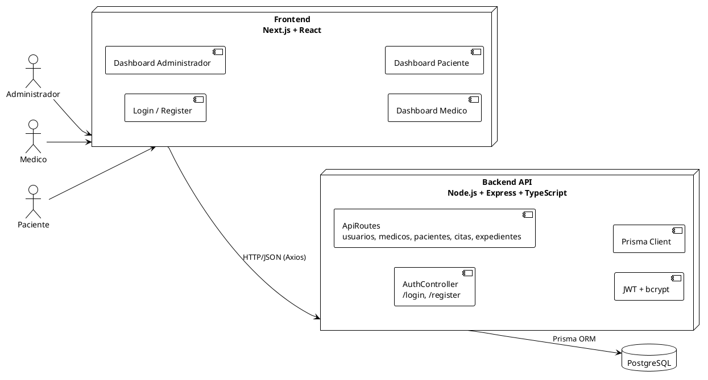
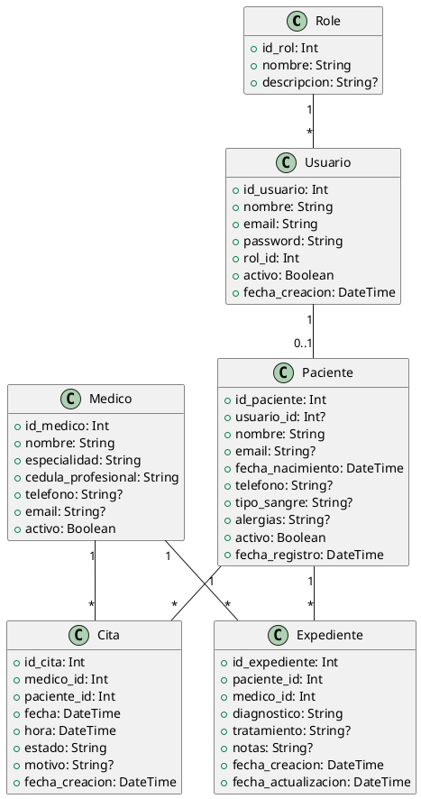
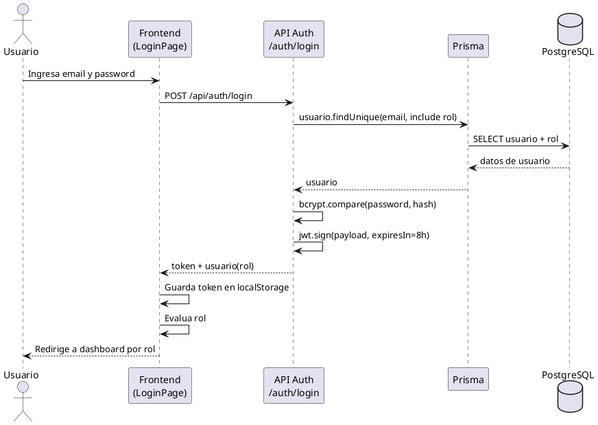
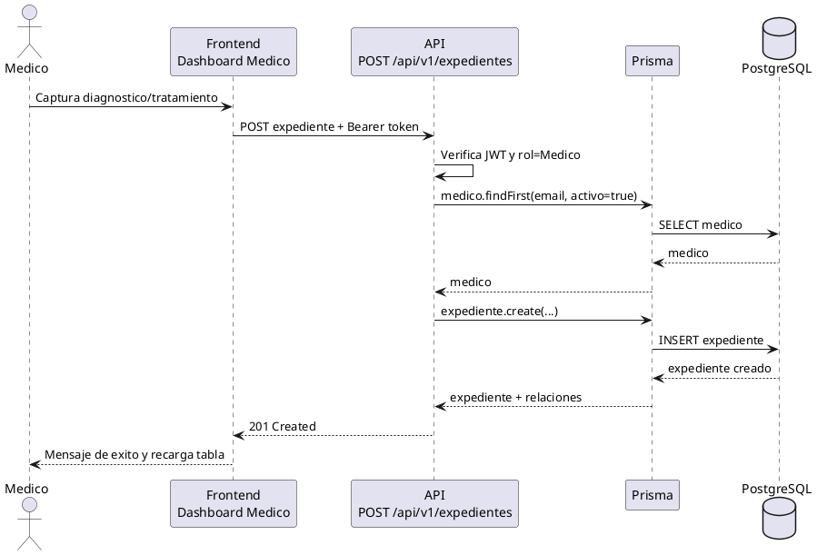
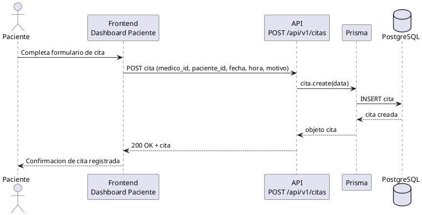
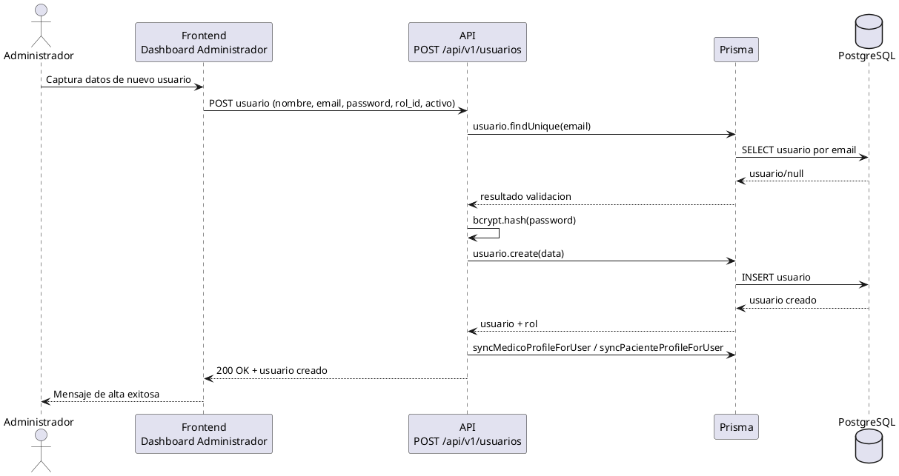

# Entrega 3 - Arquitectura, Diseño de Base de Datos, UML y Mockups

Fecha: 24 de marzo de 2026
Proyecto: MediSystem

---

## 3.1 Arquitectura de software propuesta

### 3.1.1 Estilo arquitectónico

MediSystem implementa una arquitectura web en 3 capas con cliente desacoplado:

1. Capa de presentación: Frontend en Next.js (App Router) con páginas por rol.
2. Capa de aplicación/API: Backend en Node.js + Express + TypeScript.
3. Capa de datos: PostgreSQL, modelado con Prisma ORM.

### 3.1.2 Componentes principales

- Frontend (Next.js)
  - Login y registro.
  - Dashboards separados para Administrador, Médico y Paciente.
  - Consumo de API mediante Axios.
  - Persistencia de sesión en localStorage (token y usuario).

- Backend (Express)
  - Módulo de autenticación (`/api/auth`): login y register.
  - Módulo de dominio (`/api/v1`): CRUD de usuarios, médicos, pacientes, citas y expedientes.
  - Middleware de seguridad y observabilidad: `helmet`, `cors`, `morgan`, `body-parser`.
  - Lógica de negocio para sincronización usuario-medico y usuario-paciente.

- Persistencia (PostgreSQL + Prisma)
  - Entidades: Role, Usuario, Medico, Paciente, Cita, Expediente.
  - Integridad referencial mediante claves foráneas.
  - Restricciones de unicidad (correo, nombre de rol, cédula profesional).

### 3.1.3 Diagrama de arquitectura (alto nivel)



### 3.1.4 Justificación técnica

- Separación frontend/backend: facilita despliegue independiente y mantenimiento.
- Prisma ORM: reduce errores de consultas SQL manuales y acelera evolución del modelo.
- JWT: habilita autenticación stateless para escalar API.
- Dashboards por rol: mejora usabilidad y seguridad por contexto funcional.

---

## 3.2 Diseño de base de datos

### 3.2.1 Modelo E-R propuesto (alineado al schema.prisma actual)

```mermaid
erDiagram
    roles ||--o{ usuarios : "rol_id"
    usuarios ||--o| pacientes : "usuario_id"
    medicos ||--o{ citas : "medico_id"
    pacientes ||--o{ citas : "paciente_id"
    medicos ||--o{ expedientes : "medico_id"
    pacientes ||--o{ expedientes : "paciente_id"

    roles {
        Int id_rol PK
        String nombre UNIQUE
        String descripcion
    }

    usuarios {
        Int id_usuario PK
        String nombre
        String email UNIQUE
        String password
        Int rol_id FK
        Boolean activo
        DateTime fecha_creacion
    }

    medicos {
        Int id_medico PK
        String nombre
        String especialidad
        String cedula_profesional UNIQUE
        String telefono
        String email
        Boolean activo
    }

    pacientes {
        Int id_paciente PK
        Int usuario_id FK UNIQUE
        String nombre
        String email UNIQUE
        DateTime fecha_nacimiento
        String telefono
        String tipo_sangre
        String alergias
        Boolean activo
        DateTime fecha_registro
    }

    citas {
        Int id_cita PK
        Int medico_id FK
        Int paciente_id FK
        DateTime fecha
        DateTime hora
        String estado
        String motivo
        DateTime fecha_creacion
    }

    expedientes {
        Int id_expediente PK
        Int paciente_id FK
        Int medico_id FK
        String diagnostico
        String tratamiento
        String notas
        DateTime fecha_creacion
        DateTime fecha_actualizacion
    }
```

### 3.2.2 Decisiones de diseño

- Se modela `Usuario` como entidad de autenticación/autorización.
- `Role` desacopla permisos de la cuenta de usuario.
- `Paciente` puede vincularse a `Usuario` mediante `usuario_id` para autogestión del portal.
- `Medico` y `Paciente` se relacionan con `Cita` y `Expediente` para trazabilidad clínica.
- Se incluye `activo` para habilitar baja lógica en perfiles.

---

## 3.3 Diccionario de datos

### 3.3.1 Tabla `roles`

| Campo | Tipo | Nulo | Restricciones | Descripción |
|---|---|---|---|---|
| id_rol | Int | No | PK, autoincrement | Identificador del rol |
| nombre | String | No | UNIQUE | Nombre del rol (Administrador, Medico, Paciente) |
| descripcion | String | Sí | - | Descripción funcional del rol |

### 3.3.2 Tabla `usuarios`

| Campo | Tipo | Nulo | Restricciones | Descripción |
|---|---|---|---|---|
| id_usuario | Int | No | PK, autoincrement | Identificador del usuario |
| nombre | String | No | - | Nombre completo |
| email | String | No | UNIQUE | Correo para login |
| password | String | No | Hash bcrypt | Contraseña cifrada |
| rol_id | Int | No | FK -> roles.id_rol | Rol asignado |
| activo | Boolean | No | default true | Estado del usuario |
| fecha_creacion | DateTime | No | default now() | Fecha de registro |

### 3.3.3 Tabla `medicos`

| Campo | Tipo | Nulo | Restricciones | Descripción |
|---|---|---|---|---|
| id_medico | Int | No | PK, autoincrement | Identificador del médico |
| nombre | String | No | - | Nombre del médico |
| especialidad | String | No | - | Especialidad médica |
| cedula_profesional | String | No | UNIQUE | Cédula profesional |
| telefono | String | Sí | - | Teléfono de contacto |
| email | String | Sí | - | Correo del médico |
| activo | Boolean | No | default true | Estado laboral |

### 3.3.4 Tabla `pacientes`

| Campo | Tipo | Nulo | Restricciones | Descripción |
|---|---|---|---|---|
| id_paciente | Int | No | PK, autoincrement | Identificador del paciente |
| usuario_id | Int | Sí | FK -> usuarios.id_usuario, UNIQUE | Vinculación al usuario del portal |
| nombre | String | No | - | Nombre del paciente |
| email | String | Sí | UNIQUE | Correo de contacto |
| fecha_nacimiento | DateTime | No | - | Fecha de nacimiento |
| telefono | String | Sí | - | Teléfono |
| tipo_sangre | String | Sí | - | Grupo sanguíneo |
| alergias | String | Sí | - | Alergias relevantes |
| activo | Boolean | No | default true | Estado del paciente |
| fecha_registro | DateTime | No | default now() | Alta del paciente |

### 3.3.5 Tabla `citas`

| Campo | Tipo | Nulo | Restricciones | Descripción |
|---|---|---|---|---|
| id_cita | Int | No | PK, autoincrement | Identificador de la cita |
| medico_id | Int | No | FK -> medicos.id_medico | Médico asignado |
| paciente_id | Int | No | FK -> pacientes.id_paciente | Paciente asignado |
| fecha | DateTime | No | - | Fecha de la cita |
| hora | DateTime | No | - | Hora de la cita |
| estado | String | No | default "Pendiente" | Estado de atención |
| motivo | String | Sí | - | Motivo de consulta |
| fecha_creacion | DateTime | No | default now() | Fecha de creación |

### 3.3.6 Tabla `expedientes`

| Campo | Tipo | Nulo | Restricciones | Descripción |
|---|---|---|---|---|
| id_expediente | Int | No | PK, autoincrement | Identificador del expediente |
| paciente_id | Int | No | FK -> pacientes.id_paciente | Paciente del expediente |
| medico_id | Int | No | FK -> medicos.id_medico | Médico responsable |
| diagnostico | String | No | - | Diagnóstico clínico |
| tratamiento | String | Sí | - | Tratamiento indicado |
| notas | String | Sí | - | Notas complementarias |
| fecha_creacion | DateTime | No | default now() | Fecha de creación |
| fecha_actualizacion | DateTime | No | updatedAt | Última modificación |

---

## 3.4 Diagramas UML

### 3.4.1 Diagrama de clases



### 3.4.2 Diagrama de secuencia (Login y redirección por rol)



### 3.4.3 Diagrama de secuencia (Creación de expediente por médico)



### 3.4.4 Diagrama de secuencia (Paciente solicita una cita)



### 3.4.5 Diagrama de secuencia (Administrador crea usuario)



---

## 3.5 Prototipos de interfaz (Mockups)

Los mockups se basan en la implementación actual del frontend (Next.js), por lo que son prototipos de alta fidelidad funcional.

### 3.5.1 Mockup: Inicio de sesión

Objetivo: autenticar usuarios y redirigir por rol.

Estructura:
- Panel lateral visual con branding MediSystem.
- Formulario con campos: correo, contraseña.
- Alertas de error cuando credenciales no son válidas.
- Enlace a registro para pacientes nuevos.

```text
+--------------------------------------------------------------+
| [Brand MediSystem]                 [Login Form]              |
|  - Icono                            Correo [______________]  |
|  - Mensaje institucional             Clave  [______________]  |
|                                      [ Iniciar Sesion ]      |
|                                      Error/Info              |
|                                      Link: Crear cuenta      |
+--------------------------------------------------------------+
```

### 3.5.2 Mockup: Registro de paciente

Objetivo: alta de cuenta paciente desde portal público.

Estructura:
- Formulario: nombre, correo, contraseña.
- Mensaje de éxito y redirección automática al login.
- Validación de correo duplicado.

```text
+--------------------------------------------------------------+
| [Ilustracion lateral]             [Registro Paciente]        |
|                                   Nombre [_______________]   |
|                                   Correo [_______________]   |
|                                   Clave  [_______________]   |
|                                   [ Crear mi cuenta ]        |
|                                   Error/Exito                |
+--------------------------------------------------------------+
```

### 3.5.3 Mockup: Dashboard Administrador

Objetivo: administración integral de catálogo clínico.

Módulos en sidebar:
- Dashboard.
- Plantilla médica (CRUD).
- Pacientes (CRUD).
- Citas (CRUD).
- Gestión de usuarios (solo rol Administrador).

Características visuales:
- Tarjetas KPI (médicos, pacientes, citas).
- Tablas con búsqueda, paginación y acciones editar/eliminar.
- Modales para crear/editar entidades.

```text
+-------------------+------------------------------------------+
| Sidebar Admin     | Header + Notificaciones                  |
| - Dashboard       +------------------------------------------+
| - Medicos         | [KPI] [KPI] [KPI]                        |
| - Pacientes       |------------------------------------------|
| - Citas           | Tabla + buscador + paginacion + modales |
| - Usuarios        |                                          |
+-------------------+------------------------------------------+
```

### 3.5.4 Mockup: Dashboard Médico

Objetivo: gestión de agenda y expediente clínico.

Módulos:
- Mi Agenda.
- Base de Pacientes.
- Expedientes.

Características:
- Visualización de citas en tabla.
- Vista rápida de expediente desde agenda.
- Formulario para crear/editar expediente.

```text
+-------------------+------------------------------------------+
| Sidebar Medico    | Header Medico                            |
| - Mi Agenda       +------------------------------------------+
| - Pacientes       | Agenda de consultas                      |
| - Expedientes     | [Ver expediente] [Crear/Editar]          |
+-------------------+------------------------------------------+
```

### 3.5.5 Mockup: Dashboard Paciente

Objetivo: autogestión de citas y consulta de expediente personal.

Módulos:
- Mis Citas.
- Solicitar Cita.
- Mi Expediente.

Características:
- Historial de citas con estado.
- Formulario de solicitud (médico, fecha/hora, motivo).
- Consulta de expedientes creados por médicos.

```text
+-------------------+------------------------------------------+
| Sidebar Paciente  | Header Paciente                          |
| - Mis Citas       +------------------------------------------+
| - Solicitar Cita  | Tabla citas / Formulario / Expediente    |
| - Mi Expediente   |                                          |
+-------------------+------------------------------------------+
```

### 3.5.6 Observaciones de usabilidad

- Navegación consistente con sidebar para roles autenticados.
- Feedback inmediato con alertas/toast y validaciones.
- Diseño responsive con adaptación móvil/escritorio.
- Separación por rol reduce errores operativos y mejora experiencia.

---

## Conclusión de la Entrega 3

La arquitectura definida en capas, el diseño relacional de base de datos y los diagramas UML propuestos son consistentes con el estado actual de MediSystem y permiten una evolución controlada del sistema. La interfaz implementada ya materializa los mockups funcionales para los tres roles de negocio, asegurando trazabilidad entre requerimientos, diseño y ejecución.
